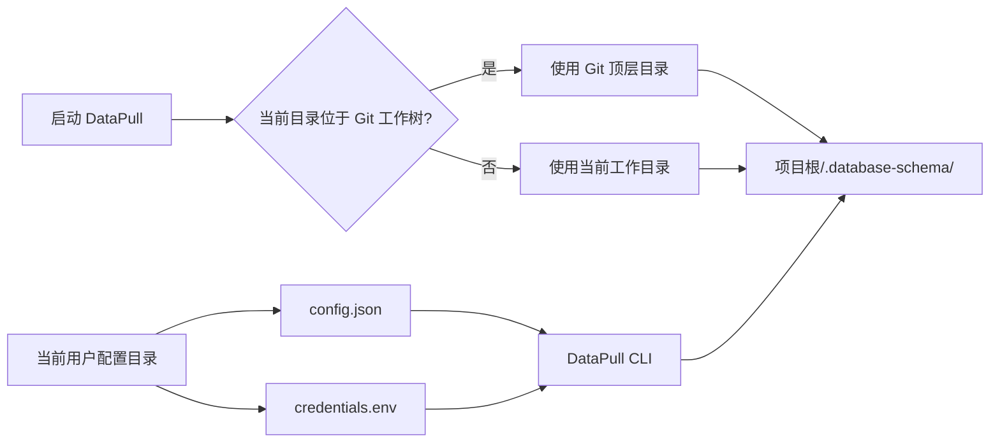
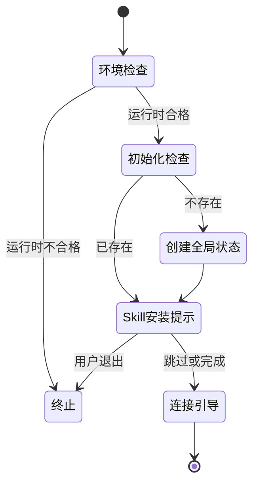

# DataPull 软件需求规格说明书（第 1—5 章草稿）

> 文档状态：章节草稿  
> 适用版本：首版（v1）  
> 编写日期：2026-09-18  
> 本草稿覆盖：第 1—5 章；后续章节将补充引导流程、结构拉取、目录覆盖、命令接口、DataPull Skill、非功能需求及完整验收矩阵。

## 1. 引言

### 1.1 编写目的与预期读者

本文档定义 DataPull 首版的可实现、可验证需求。DataPull 是一个通过 NPM 发布的命令行产品：它优先为人在终端内完成登记连接、校验、选择目标数据库和获取数据库对象的结构文件提供中文交互；同时向高级用户和 Agent 提供稳定的命令模式接口。

本文档的预期读者为：

- 使用 DataPull 管理并拉取数据库结构文件的用户；
- 实现、测试和发布 `@yg-toolkit/datapull` 的研发与质量人员；
- 使用 DataPull Skill 协助用户安装或调用 CLI 的 Agent 维护者；
- 审查数据库访问、凭证处理和项目文件变更边界的安全与运维人员。

除非后续章节另有说明，本文中的“必须”表示首版验收条件，“应”表示实现约束或推荐行为，“可以”表示用户可选行为。

### 1.2 项目背景与问题陈述

团队需要将多个数据库中的对象定义保存为便于浏览、检索和版本控制的 SQL 文件。现有 `database-schema` Skill 可作为业务行为和测试场景的参考，但它不是面向终端用户的独立产品，也不满足 NPM 分发、跨平台依赖引导、连接登记簿、完整交互流程和稳定命令接口的要求。

当前用户在执行结构文件拉取时，容易遇到以下问题：

1. 数据库客户端工具、运行环境和访问权限缺失时，缺乏可理解的诊断及恢复路径；
2. 连接参数、目标数据库和凭证缺少可复用且安全的本地管理方式；
3. 在子目录运行、重复拉取或只更新部分对象类型时，输出位置和覆盖影响不够直观；
4. Agent 虽可辅助用户，却不能以不透明方式安装全局工具或接触数据库凭证。

DataPull 通过统一的中文引导模式、用户级全局连接登记簿、项目级结构文件集和分层命令模式解决上述问题。

### 1.3 产品目标与成功标准

DataPull 的业务目标如下：

- 让用户在不记忆复杂参数的前提下，从终端完成一次可恢复的数据库结构文件拉取；
- 让同一用户能跨项目复用登记连接，而不将数据库凭证写入项目文件；
- 让项目中的 `.database-schema/` 成为可由用户和 Agent 直接浏览的结构文件集；
- 让 CLI 的依赖、安装及覆盖行为在操作前可见、可确认、可诊断；
- 在不改变现有 `database-schema` Skill 的前提下，提供独立演进的 DataPull CLI 与 DataPull Skill。

首版成功的最低判定为：在本期支持的平台和数据库组合上，用户可通过公开 NPM 包安装 CLI，完成隐藏凭证输入、连接校验、目标数据库选择和对象类型选择；成功后可在正确的项目根目录获得结构文件；失败时已有结构文件及已填写输入受到保护并获得中文恢复选项。与此对应的可执行验收将在第 12 章集中定义。

### 1.4 定义与缩写

本章先列出阅读第 1—5 章所必需的术语；完整术语表见附录 14.1。后续章节必须沿用这些称谓。

| 术语 | 定义 |
|---|---|
| DataPull | 面向人类交互、同时可被 Agent 调用的数据库结构文件拉取 CLI。 |
| DataPull Skill | 检测环境、协助用户安装 DataPull、指导 Agent 安全调用 CLI 的轻量 Skill。 |
| 引导模式 | 只执行 `datapull` 时进入的中文分步交互流程。 |
| 命令模式 | 通过子命令和参数直接执行操作的非交互流程。 |
| 登记连接 | 保存服务器信息、认证引用与连接安全策略的连接配置。 |
| 全局连接登记簿 | 当前用户可跨项目复用的登记连接集合。 |
| 数据库凭证 | 独立保存、用于数据库身份认证且不得进入日志或结构文件的秘密值。 |
| 目标数据库 | 一次拉取明确选择或输入的真实数据库。 |
| 数据库对象 | 可用 DDL 表达的表、视图、函数、过程、触发器等命名实体。 |
| 结构文件集 | DataPull 按对象类型维护的 DDL 文件集合，不承诺所有类型来自同一时点。 |
| Skill 安装目标 | 用户选择的 Agent 工具与用户级或项目级安装范围组合。 |

### 1.5 参考资料与决策记录

本 SRS 的需求事实和架构决策来源如下。引用这些资料仅用于界定新产品，绝不意味着运行时复用旧实现。

| 编号 | 资料 | 用途 |
|---|---|---|
| REF-001 | `.yg-pm/projects/datapull/source-requirements.md` | 原始需求、已确认产品决策及数据库能力基线。 |
| REF-002 | `.yg-pm/projects/datapull/drafts/outline-20260918-165112.md` | 已确认章节结构、术语表、需求 ID 和范围边界。 |
| ADR-0003 | `docs/adr/0003-reuse-schema-directory-without-legacy-compatibility.md` | 复用 `.database-schema/` 名称但不承诺旧技能兼容。 |
| ADR-0004 | `docs/adr/0004-confirm-before-installing-database-tools.md` | 自动安装数据库工具前必须展示计划并确认。 |
| ADR-0005 | `docs/adr/0005-build-datapull-independently-without-python-runtime.md` | 使用 Node.js/TypeScript 独立构建，不依赖 Python 运行时。 |
| ADR-0006 | `docs/adr/0006-own-datapull-skill-source-in-cli-package.md` | DataPull Skill 唯一源码归属及同步原则。 |

## 2. 产品范围与边界

### 2.1 目标用户与核心场景

| 用户类型 | 使用场景 | 期望可观察结果 |
|---|---|---|
| 数据库维护人员或开发人员 | 首次在本机登记一个可访问的数据库连接并拉取对象定义。 | 经引导输入后，连接可被校验并复用，结构文件写入项目根目录。 |
| 项目开发人员 | 在 Git 仓库的任意子目录更新某个目标数据库的表或视图定义。 | CLI 自动定位 Git 顶层目录；未选择的对象类型不受影响。 |
| 高级用户 | 以明确参数执行连接管理、拉取、诊断或 Skill 安装。 | 子命令行为可预测，结果可由退出码和可选 JSON 判断。 |
| 使用 Agent 的用户 | Agent 已获得 DataPull Skill，但本机未安装或未正确配置 CLI。 | Skill 检测环境并给出准确安装命令；用户自行执行安装，Agent 后续指导调用。 |

### 2.2 本期包含范围

首版必须包含以下能力：

1. 通过公开 NPM 包 `@yg-toolkit/datapull` 安装，安装后提供 `datapull` 命令；
2. 中文优先的引导模式，包括列表单选、多选、普通输入、隐藏输入、确认、任务清单和动态进度；
3. MySQL、PostgreSQL、SQL Server 的登记连接管理、连接校验、目标数据库枚举或手工输入及校验；
4. 用户级全局连接登记簿与独立的用户级数据库凭证文件；
5. 使用各数据库官方客户端或官方脚本组件获取数据库对象 DDL，并写入当前项目的 `.database-schema/`；
6. 对所选对象类型执行“全部成功后整体覆盖”，未选择对象类型保留；
7. `connection`、`pull`、`skill`、`config`、`doctor` 等分层子命令，以及稳定退出码和可选 `--json`；
8. 对数据库官方工具执行跨平台检测；在用户确认后使用识别到的系统包管理器进行自动安装，失败时给出手工指引；
9. 内置 DataPull Skill 的安装、同步保护和反向安装协助，首版固定支持 Codex、Claude Code、Cursor、Trae IDE。

### 2.3 本期不包含范围

以下事项不属于首版交付或验收范围：

- 修改、迁移、调用或兼容现有 `plugins/yg-toolkit/skills/database-schema/`；
- Python 运行时依赖、`datapull update` 自更新命令，以及 Docker 或其他容器化工具备用路径；
- 业务数据、用户、角色、授权、对象所有者、MySQL `DEFINER`、服务器级配置的导出；
- 云 IAM、OAuth、SSH 隧道、跳板机认证；
- TraeCode CLI、未在本 SRS 列明的 Agent 工具，以及完整中英文界面切换；
- 承诺所有对象类型来自同一时点的完整结构快照，或提供历史快照版本管理；
- 在 Agent 未取得用户许可时，由 Agent 代为执行全局 NPM 安装或由 Agent 收集、传递数据库凭证。

### 2.4 与现有 `database-schema` Skill 的边界

DataPull 继续使用 `.database-schema/` 作为项目结构文件的根目录，目的是保留用户对目录位置的认知，避免出现两个近义的输出目录。除此之外，DataPull 的配置模型、SQL 文件组织、覆盖规则和命令行为均由本 SRS 定义。

现有 `database-schema` Skill 必须保持不变。DataPull 不读取、迁移或写回该 Skill 的配置，也不保证两者生成的文件格式可相互读取、对比或继续处理。用户在同一项目中混用两者时，应自行确认文件归属；DataPull 不得以“兼容”为理由修改旧文件或旧技能。

### 2.5 范围业务规则

| 规则 ID | 规则 | 可观察结果 |
|---|---|---|
| BR-SCP-001 | DataPull 的默认受众是人类终端用户；命令模式是补充接口，不得降低引导模式的完整性。 | 仅输入 `datapull` 时始终进入中文分步流程。 |
| BR-SCP-002 | 结构文件集按对象类型独立维护，不以“结构快照”对外承诺一致时间点。 | 用户只刷新表时，旧视图文件仍被保留。 |
| BR-SCP-003 | Agent 只能协助环境检查、安装说明和调用指导，不得取得或打印数据库凭证。 | Skill 的文案和调用流程不要求用户在聊天中提供密码。 |
| BR-SCP-004 | 复用输出目录名称不构成旧技能兼容承诺。 | DataPull 的首次运行不执行旧目录扫描、导入或迁移。 |

## 3. 总体产品模型

### 3.1 产品组件与职责

DataPull 由 CLI、DataPull Skill、用户级配置与凭证、项目级结构文件集、操作系统包管理器和数据库官方工具组成。数据库服务器不属于 DataPull 管理范围；DataPull 仅使用用户提供且经过校验的访问方式读取所选对象定义。

```mermaid
flowchart TB
    U[用户] --> CLI[DataPull CLI]
    A[Agent] --> SK[DataPull Skill]
    SK -->|环境检测、安装命令、调用指导| U
    SK -->|指导调用| CLI

    CLI --> CFG[全局连接登记簿 config.json]
    CLI --> SEC[数据库凭证 credentials.env]
    CLI --> ROOT[项目根目录]
    ROOT --> SET[.database-schema 结构文件集]

    CLI --> DOC[依赖诊断与安装计划]
    DOC --> PM[系统包管理器]
    PM --> TOOL[数据库官方工具]
    CLI --> TOOL
    TOOL --> DB[(MySQL / PostgreSQL / SQL Server)]

    subgraph 发布来源
      PKG[@yg-toolkit/datapull NPM 包]
      SRC[cli/datapull/skill 唯一源码]
      PKG --- SRC
    end
    PKG --> CLI
```

组件职责边界如下：

| 组件 | 必须负责 | 不得负责 |
|---|---|---|
| DataPull CLI | 交互、命令解析、配置管理、依赖诊断、数据库校验、拉取编排、结构文件写入和 Skill 安装。 | 运行时调用现有 Python 脚本；替用户决定安装外部工具；导出业务数据。 |
| DataPull Skill | 检测 DataPull、Node.js 与 NPM 环境，提供用户执行的安装命令，指导 Agent 调用 CLI。 | 存储或询问数据库凭证；复制数据库拉取逻辑；未经用户执行安装全局 CLI。 |
| 数据库官方工具 | 按数据库引擎执行连接、查询或 DDL 生成。 | 管理 DataPull 配置、项目输出目录或 Agent Skill。 |
| 全局连接登记簿 | 保存非秘密的登记连接、目标数据库偏好和用户偏好。 | 保存明文秘密或项目结构文件。 |
| 数据库凭证文件 | 保存数据库凭证值。 | 保存项目路径、DDL、日志或 Agent 安装状态。 |
| 结构文件集 | 保存本次或历史成功获取的对象 SQL 文件。 | 保存凭证、业务数据、账户和授权定义。 |

### 3.2 引导模式与命令模式

DataPull 必须根据入口选择运行模式：没有子命令和业务参数时进入引导模式；具有有效子命令或明确命令参数时进入命令模式。两种模式必须复用同一连接校验、数据库校验、对象范围校验和文件覆盖业务规则，避免同一输入在不同模式下产生不同结果。

| 模式 | 入口 | 主要对象 | 输出约定 | 失败处理 |
|---|---|---|---|---|
| 引导模式 | `datapull` | 人类终端用户 | 中文提示、可视进度和结果摘要。 | 保留已输入信息，并提供重试、修改、返回连接选择或退出。 |
| 命令模式 | 例如 `datapull pull ...` | 高级用户、Agent、自动化环境。 | 人类可读文本；显式 `--json` 时输出稳定 JSON。 | 不进入交互恢复；返回稳定错误代码和非零退出码。 |

无 TTY 环境不得尝试渲染交互控件或等待隐藏输入；此时仅允许参数完整的命令模式。缺少必要参数时，CLI 必须失败并给出切换到交互终端或补齐参数的中文说明。完整命令接口见第 9 章。

### 3.3 用户级全局状态与项目级结构文件

全局连接登记簿和数据库凭证属于当前操作系统用户，可跨项目复用；项目根目录及其 `.database-schema/` 属于当前执行的项目。CLI 必须先确定项目根目录：当前目录位于 Git 工作树时使用 Git 顶层目录，否则使用当前工作目录。第 8 章定义具体目录结构、锁和覆盖事务。



这一划分产生以下不可变规则：

- DataPull 不得将数据库凭证写入项目目录、结构文件、标准输出、标准错误或日志；
- DataPull 不得因拉取而修改项目根 `.gitignore`；临时目录、锁和本地运行状态的忽略规则由第 8 章定义；
- 更换项目不应要求重复登记同一连接；删除项目目录也不得删除全局连接登记簿或数据库凭证；
- 删除登记连接的影响仅限当前用户全局状态，不得删除任何项目中已有的结构文件集。

### 3.4 运行环境与技术约束

| 约束 ID | 约束 | 验证方式 |
|---|---|---|
| CON-001 | CLI 源码必须位于 `cli/datapull/`，使用 TypeScript/Node.js 独立实现。 | 发布包构建清单与运行时依赖审查不包含旧技能 Python 脚本。 |
| CON-002 | Node.js 版本必须不低于 `22.12`。 | `doctor` 和首次运行可报告当前版本；不满足时阻止执行并给出升级指引。 |
| CON-003 | 发布包必须为公开 NPM 包 `@yg-toolkit/datapull`，二进制命令为 `datapull`。 | 全新环境安装后可解析该命令。 |
| CON-004 | 首版必须支持 Windows 10/11、macOS、Ubuntu LTS、Debian Stable、Fedora。 | 第 12 章的操作系统与数据库矩阵通过。 |
| CON-005 | 数据库结构获取依赖官方工具：MySQL 使用 `mysql`；PostgreSQL 使用 `psql` 与 `pg_dump`；SQL Server 使用 `sqlcmd`、PowerShell 与官方 `SqlServer` 模块。 | `doctor` 能按引擎报告状态；集成测试验证实际拉取。 |
| CON-006 | 缺失工具时，交互模式必须先展示安装计划并取得确认；未识别包管理器只能提供手工指引。 | 未确认前系统环境不发生安装操作。 |
| CON-007 | CLI 不提供自更新命令；升级由用户使用 NPM 完成。 | 帮助与命令树中不存在 `datapull update`。 |

### 3.5 需求追溯

本章为第 4—12 章建立共同模型，主要支撑 FR-001、FR-002、FR-007、FR-011、FR-012、FR-013、FR-015 和 NFR-001 至 NFR-005；每项功能的规范性要求及验收标准在其主要章节中定义。

## 4. 安装、初始化与升级

**关联需求：FR-001（NPM 安装与首次运行）**

### 4.1 公开 NPM 包与 `datapull` 命令

DataPull 必须以公开 NPM 包 `@yg-toolkit/datapull` 发布。用户可使用 NPM 的全局安装方式安装首版，例如：

```text
npm install --global @yg-toolkit/datapull
```

安装成功后，终端必须可执行 `datapull --help`。NPM 安装生命周期脚本不得启动交互界面、读取数据库配置、尝试访问数据库或安装 DataPull Skill；首次运行才可以触发初始化和 Skill 安装引导。

CLI 的帮助、交互提示和错误解释必须使用简体中文；包名、命令、子命令、选项、JSON 字段和错误代码必须使用英文稳定标识。帮助文本应指向引导模式、连接管理、拉取、Skill、配置和诊断等命令族，但不得宣传不在本期范围内的自更新或容器备用能力。

### 4.2 Node.js 与 NPM 环境检查

首次运行、`datapull doctor` 以及会启动核心业务流程的命令，必须检查 Node.js 版本是否满足 `>=22.12`。版本不足、无法读取版本或 NPM 不可用时，CLI 必须：

1. 阻止需要该运行时的后续操作；
2. 在标准错误中给出中文原因、检测到的版本（如可获取）和升级建议；
3. 在命令模式返回稳定错误代码与非零退出码；
4. 不创建或覆盖全局配置、数据库凭证及项目结构文件。

此检查不等同于数据库官方工具检查：Node.js/NPM 是 CLI 的运行前提，数据库官方工具是特定引擎拉取前提。后者的检测与确认式安装见第 6 章和第 7 章。

### 4.3 首次运行初始化

当 DataPull 发现全局连接登记簿不存在时，必须将该情况视为首次初始化，而不是错误。引导模式必须按以下状态流转执行：



首次初始化的要求如下：

- CLI 必须显示将创建的用户级配置位置和秘密文件位置，但不得输出既有秘密内容；
- 创建全局连接登记簿时必须写入可识别的 `version` 字段和空的连接集合；
- 创建数据库凭证文件时必须使用可手工编辑的环境变量格式；文件可以为空；
- CLI 应尽力将数据库凭证文件的访问权限收敛到当前用户。若系统无法设置或验证该权限，必须给出中文安全提示，但不得伪称已完成权限保护；
- 首次运行可以提示安装内置 DataPull Skill，但用户跳过该步骤不得阻塞连接登记或结构文件拉取；
- 用户在任何初始化确认界面选择退出时，不得创建未确认的 Skill 安装目标，也不得自动安装任何外部数据库工具。

### 4.4 CLI 升级边界

DataPull 不得实现 `datapull update` 或其他自更新命令。CLI 升级由用户通过当前 NPM 安装方式完成；CLI 可在帮助或诊断输出中显示当前版本，但不得自行调用 NPM 修改全局包。

升级后的首次运行可以检测内置 DataPull Skill 是否存在可同步版本，并按第 10 章的副本修改保护规则提示用户同步。该提示不应阻塞普通连接管理或拉取任务，也不得未经用户确认覆盖已经被用户修改的 Skill 副本。

### 4.5 卸载与残留数据提示

NPM 卸载 CLI 不等同于删除用户级全局连接登记簿、数据库凭证、项目结构文件或已安装的 DataPull Skill。CLI 帮助与卸载说明必须明确这些残留项可能继续存在，并提供“显示配置路径”的只读命令入口。首版不要求 CLI 自动删除这些数据，以避免卸载时误删用户凭证或项目文件。

### 4.6 安装与初始化验收标准

| 验收 ID | Given | When | Then |
|---|---|---|---|
| AC-FR-001-01 | 支持平台中已安装 Node.js `>=22.12` 和 NPM 的干净用户环境。 | 用户全局安装 `@yg-toolkit/datapull` 后执行 `datapull --help`。 | 命令成功执行，帮助为中文，且可见 `connection`、`pull`、`skill`、`config`、`doctor` 命令族。 |
| AC-FR-001-02 | NPM 正在安装或升级 DataPull。 | NPM 生命周期脚本运行。 | 不启动交互，不创建全局状态，不访问数据库，不安装 Skill。 |
| AC-FR-001-03 | Node.js 低于 `22.12`。 | 用户执行任一需要 CLI 运行时的入口。 | CLI 不执行数据库或文件写入操作，并返回中文升级说明、稳定错误代码和非零退出码。 |
| AC-FR-001-04 | 合格运行时下不存在全局连接登记簿。 | 用户首次执行 `datapull`。 | CLI 显示用户级路径；经用户继续后创建带版本字段的配置和可手工编辑的秘密文件，并可继续连接引导。 |
| AC-FR-001-05 | 已安装旧版 CLI 与未修改的内置 Skill 副本。 | 用户用 NPM 升级 CLI 并首次运行。 | CLI 不自更新自身；可提示 Skill 同步，且不阻塞核心功能。 |
| AC-FR-001-06 | 用户卸载 NPM 包。 | 用户检查项目和用户配置目录。 | CLI 包被卸载；已有全局连接登记簿、数据库凭证、结构文件集和 Skill 副本均未被静默删除。 |

## 5. 连接与凭证管理

**关联需求：FR-003（连接 CRUD）、FR-004（凭证管理）、FR-005（多数据库选择）、FR-017（收藏管理）**

### 5.1 管理目标与数据边界

连接与凭证管理的目标是使用户能够在 CLI 中输入并长期复用数据库访问所需信息，同时保留用户通过文件进行受控手工维护的能力。DataPull 必须把可公开的连接元数据与数据库凭证分开保存：前者位于全局连接登记簿 `config.json`，后者位于独立的 `credentials.env`。

一个登记连接表示一个可连接的服务器或完整连接 URL，以及对应引擎、认证引用与连接安全策略；它不是一个固定的目标数据库。一个登记连接可以关联多个最近使用或收藏的目标数据库，也可以在每次拉取时重新枚举或手工输入新的目标数据库。

| 数据类别 | 保存位置 | 允许内容 | 禁止内容 |
|---|---|---|---|
| 全局连接登记簿 | 当前用户配置目录的 `config.json` | 版本、连接别名、引擎、主机或非秘密 URL 信息、端口、用户名或认证引用、TLS 策略、最近使用和收藏。 | 密码、访问令牌、完整含秘密 URL、项目结构文件内容。 |
| 数据库凭证 | 同一用户配置目录的 `credentials.env` | 密码、访问令牌或完整连接 URL 中的秘密部分，以环境变量形式保存。 | DDL、业务数据、日志、项目路径、Agent 安装状态。 |
| 项目结构文件集 | 项目根 `.database-schema/` | 数据库对象 DDL。 | 任何数据库凭证、账户、角色、授权、所有者或业务数据。 |

### 5.2 全局 `config.json` 数据模型与版本管理

`config.json` 必须是 JSON 文档，并包含顶级 `version` 字段。CLI 必须按照已知版本校验该文件；未知版本、缺少必要字段、重复连接别名、无效引擎值或无效认证引用均不得被静默修复或覆盖。CLI 应提示用户先备份或修复文件，并可通过 `datapull config validate` 获得诊断。

首版的规范性字段模型如下。字段名称是长期稳定的命令模式与配置契约；未列明字段不得被 CLI 在写回时无提示删除。

| 路径 | 必填 | 说明 |
|---|---:|---|
| `version` | 是 | 全局连接登记簿格式版本。 |
| `connections` | 是 | 登记连接集合，初始值为空集合。 |
| `connections[].name` | 是 | 用户可读且在全局连接登记簿内唯一的连接别名。 |
| `connections[].engine` | 是 | `mysql`、`postgresql` 或 `sqlserver`。 |
| `connections[].host` / `connections[].port` | 条件必填 | 使用主机连接时的非秘密地址与端口。 |
| `connections[].urlRef` | 条件必填 | 使用完整连接 URL 时指向数据库凭证文件中的变量名，不得直接保存 URL。 |
| `connections[].username` | 条件必填 | 使用用户名认证时的非秘密用户名或其引用。 |
| `connections[].credentialRef` | 条件必填 | 指向数据库凭证文件中密码或令牌变量名的认证引用。 |
| `connections[].authMode` | 是 | 支持用户名/密码、完整连接 URL；Windows 下 SQL Server 还支持集成认证。 |
| `connections[].tls` | 是 | 连接加密与证书验证策略。SQL Server 默认必须加密并验证证书。 |
| `connections[].recentDatabases` | 否 | 按最近使用排序的目标数据库名称集合。 |
| `connections[].favoriteDatabases` | 否 | 用户显式收藏的目标数据库名称集合。 |

数据库凭证变量名必须由 CLI 生成或校验为跨平台安全标识，且与连接别名稳定关联；CLI 不得要求用户手工猜测变量名。CLI 在新增或更新连接时可以显示变量名和文件位置，但不得显示其值。

### 5.3 独立 `credentials.env` 与访问权限

数据库凭证必须由用户通过 CLI 的隐藏输入控件填写，终端不得回显输入值。CLI 必须将凭证作为独立环境变量写入 `credentials.env`，以便后续稳定读取和用户手工修改。该文件属于当前用户的本机明文存储，不能抵御已获得该用户文件访问权限的恶意程序；CLI 必须在首次创建时以中文说明该边界。

凭证处理规则如下：

| 规则 ID | 规则 |
|---|---|
| BR-SEC-001 | 密码、令牌和含秘密的连接 URL 只能写入数据库凭证文件，不得写入全局连接登记簿、命令参数历史、标准输出、标准错误、日志、诊断包或项目结构文件。 |
| BR-SEC-002 | CLI 必须在写入前尽力限制数据库凭证文件仅允许当前用户访问；不能确认权限时必须告警，但不得阻止用户手工编辑。 |
| BR-SEC-003 | CLI 读取数据库凭证时只能通过认证引用定位变量；缺失变量、空值或解析失败必须视为可恢复错误，且不得打印秘密值。 |
| BR-SEC-004 | SQL Server 必须默认启用传输加密并验证服务器证书；证书不可信时不得自动关闭加密或跳过验证。 |
| BR-SEC-005 | Agent 使用 DataPull Skill 时不得向用户索要数据库凭证，也不得将用户聊天内容写入数据库凭证文件。 |

用户手工编辑数据库凭证文件后，无需重新登记连接。下一次连接校验或拉取必须重新读取对应变量；若文件已变更但内容无效，CLI 必须仅报告变量引用和修复路径，不得回显变量值。

### 5.4 连接新增、查看、修改、删除和校验

DataPull 必须同时在引导模式与命令模式提供登记连接的新增、查看、修改、删除和校验能力。命令名称、选项和输出契约由第 9 章定义；本节定义必须保持一致的业务行为。

| 操作 | 必须行为 | 保护规则 |
|---|---|---|
| 新增 | 收集连接别名、数据库引擎、认证方式、非秘密连接参数、TLS 策略及数据库凭证；验证结构合法性后写入两个用户级文件。 | 隐藏输入不得回显；别名冲突必须要求用户修改或明确更新，不得静默覆盖。 |
| 查看 | 列出登记连接及其非秘密状态，例如引擎、主机、认证方式、最近使用和收藏数量。 | 不得显示数据库凭证值、含秘密 URL 或原始环境变量内容。 |
| 修改 | 允许修改非秘密元数据、认证引用、TLS 策略、收藏与最近使用记录；修改密码时使用隐藏输入或用户手工编辑文件。 | 对其他连接和任何项目结构文件无副作用。 |
| 删除 | 从全局连接登记簿移除指定登记连接，并处理不再被引用的凭证变量。 | 交互模式必须显示影响并确认；不得删除项目中的结构文件集。 |
| 校验 | 使用登记连接与对应数据库凭证测试到服务器的连接；目标数据库校验另见第 5.5 节。 | 错误信息必须脱敏；连接失败不得修改连接配置或结构文件。 |

删除操作处理凭证变量时，CLI 必须先检查该变量是否仍被其他登记连接引用。仍被引用时不得删除；未被引用时，交互模式应提供“保留凭证”与“删除未引用凭证”选择，并说明秘密文件被修改的影响。命令模式的删除或删除未引用凭证必须使用显式确认选项，避免脚本误删。

连接校验失败时，引导模式必须保留已填写的非秘密字段和认证引用，并提供“重试当前步骤”“修改相关信息”“返回连接选择”“退出”四类恢复入口。错误说明应区分网络不可达、认证失败、TLS 失败、客户端工具缺失和无权访问等可观察类别；不得为了提高通过率降低 TLS 安全策略。

### 5.5 一个连接对应多个目标数据库

选择登记连接后，CLI 必须尝试读取用户可访问的目标数据库列表。若引擎或账户不支持列表读取、读取失败或目标数据库不在列表中，CLI 必须允许用户手工输入名称并执行目标数据库校验；“未能枚举”不得自动等同于“目标数据库不可用”。

在引导模式中，目标数据库候选的展示顺序必须为：收藏项、最近使用项、可枚举项、手工输入。每个候选均应可被选择；收藏项必须与最近使用项视觉区分。用户成功校验并完成拉取后，CLI 必须更新该登记连接的最近使用记录；用户明确执行收藏或取消收藏时，CLI 必须更新收藏记录。最近使用记录的数量上限、排序细节和命令接口由第 9 章定义，但不得影响用户已收藏的目标数据库。

目标数据库校验必须在开始对象范围选择和写入任何项目文件前完成。校验失败时，CLI 必须保持当前登记连接选择及用户输入，允许用户重试、重新输入、返回连接选择或退出。

### 5.6 手工编辑后的重新加载与配置校验

用户可以在 CLI 未运行时手工修改 `config.json` 和 `credentials.env`。因此 CLI 每次执行连接管理、连接校验或拉取前必须从磁盘重新读取必要配置，不能仅依赖上一次进程内缓存。CLI 不要求热更新已打开的交互菜单；若操作过程中发现文件已在外部变更，必须中止该次写回、重新加载并让用户确认冲突处理，以避免覆盖用户手工修改。

`datapull config path` 必须只读显示全局连接登记簿和数据库凭证的绝对路径；`datapull config validate` 必须校验 JSON 格式、版本、字段、引用关系和数据库凭证文件可解析性。验证输出可以显示变量名和连接别名，但不得显示秘密值。未知字段的保留、版本迁移的详细策略见第 11 章可维护性要求；首版对无法理解的版本必须失败关闭，而非自动降级写回。

### 5.7 连接与凭证验收标准

| 验收 ID | Given | When | Then |
|---|---|---|---|
| AC-FR-003-01 | 不存在同名登记连接。 | 用户在引导模式新增 MySQL、PostgreSQL 或 SQL Server 登记连接。 | CLI 收集非秘密参数和隐藏凭证输入；成功后 `config.json` 只含认证引用，数据库凭证文件含相应变量。 |
| AC-FR-003-02 | 已存在登记连接和至少一个项目结构文件集。 | 用户删除登记连接并确认。 | 全局连接登记簿更新；项目结构文件集保持不变；共享凭证变量不会被删除。 |
| AC-FR-003-03 | 一个登记连接的密码错误。 | 用户执行连接校验。 | CLI 返回脱敏的认证失败说明，不显示密码，并保留重试、修改、返回连接选择和退出入口。 |
| AC-FR-004-01 | 用户在 CLI 中输入密码或含秘密连接 URL。 | CLI 写入配置并输出结果。 | 终端输入不回显；秘密不出现在 `config.json`、输出、错误、日志或项目目录。 |
| AC-FR-004-02 | 用户手工修改数据库凭证文件中的有效变量值。 | 用户再次执行连接校验。 | CLI 从磁盘读取新值并按新值校验，无需重新登记连接。 |
| AC-FR-004-03 | SQL Server 的服务器证书不可信。 | 用户执行默认连接校验。 | CLI 报告 TLS 校验失败，不自动关闭加密或证书验证。 |
| AC-FR-005-01 | 一个登记连接可枚举多个目标数据库。 | 用户进入目标数据库选择。 | 候选按收藏、最近使用、可枚举、手工输入的顺序呈现；用户可选择或输入名称。 |
| AC-FR-005-02 | 用户无权枚举数据库或枚举失败。 | 用户手工输入一个有权访问的目标数据库。 | CLI 对该名称单独校验；校验成功后允许继续，而不以枚举失败阻断流程。 |
| AC-FR-017-01 | 已校验成功一个目标数据库。 | 用户完成一次拉取并对另一个数据库执行收藏。 | 最近使用记录被更新；收藏项跨后续会话保留且优先显示。 |
| AC-FR-017-02 | 用户手工将 `config.json` 改为未知版本或无效 JSON。 | 用户运行 `datapull config validate` 或尝试拉取。 | CLI 停止写入，报告可定位的配置错误和修复路径，不静默重置或删除原文件。 |

