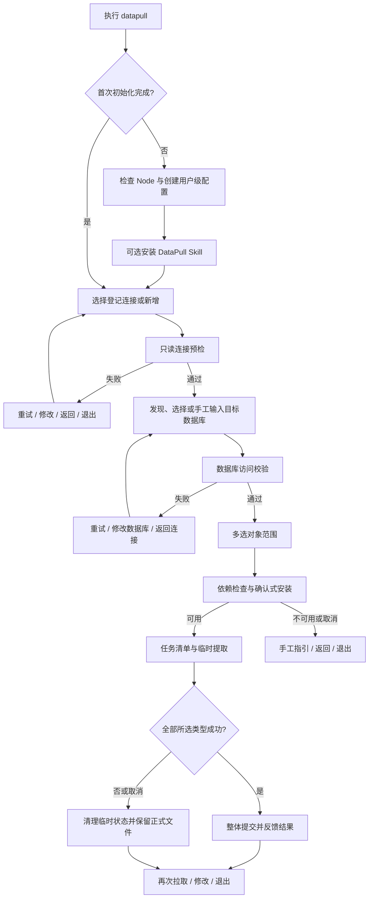

## 6 交互式引导流程

本章定义引导模式的人类操作体验。用户在交互式终端中仅执行 `datapull` 时，CLI 必须进入中文分步流程；不得要求用户记忆子命令、对象名称或数据库客户端参数。引导模式与命令模式必须调用同一套连接校验、依赖校验和结构提取规则，二者不得产生不同的安全默认值或覆盖语义。

### 6.1 首次运行与 Skill 安装引导

首次启动时，DataPull 必须先完成本机 Node.js（不低于 22.12）与全局连接登记簿可用性检查，并在不会写入秘密的前提下创建所需的用户级配置目录、版本化 `config.json` 模板和独立 `credentials.env` 模板。若已有配置，必须重新加载并校验，不能覆盖用户内容。

初始化成功后，CLI 应询问用户是否安装 DataPull Skill。该提示不得在 NPM 安装生命周期中出现；用户跳过后仍可正常管理连接和拉取结构文件。选择安装时，CLI 必须显示内置 Skill 安装目标清单（Codex、Claude Code、Cursor、Trae IDE），由用户多选目标，并对每个目标分别选择用户级或项目级范围。CLI 不得根据目录、进程或本机应用存在与否推断某个 Agent 已安装。目标标准目录不存在时，必须先预览绝对路径，取得确认后创建目录并安装。

首次引导完成后，CLI 应显示可重复进入的入口：`datapull skill install`、`datapull connection add`、`datapull pull` 与 `datapull doctor`。取消 Skill 安装或任一非关键引导项不得阻止用户进入连接选择。

### 6.2 连接选择或新增

第一业务步骤必须展示所有已启用的登记连接。每个列表项至少显示连接别名、数据库引擎、主机或安全脱敏的连接位置、最近使用状态和收藏数据库数；不得显示密码、完整含密钥 URL 或 Token。列表必须包含“新增登记连接”和“退出”。没有可选连接时，应直接进入新增登记连接流程。

新增或修改登记连接时，引导模式必须按数据库引擎显示必填项与适用的高级项，提供单选、输入、隐藏输入与确认控件：

- MySQL、PostgreSQL：支持用户名/密码或完整连接 URL 的变量引用；
- SQL Server：支持用户名/密码，且仅 Windows 支持集成认证；
- 所有引擎：允许填写主机、端口、连接别名、连接变量、超时与 TLS 安全策略；
- 数据库凭证必须由用户以隐藏输入填写到 `credentials.env`；不得回显、写入 `config.json`、命令历史、进度界面或诊断日志；
- 完整连接 URL 如含秘密，只能作为 `credentials.env` 中的值，其数据库路径不得替代本次的目标数据库选择。

连接别名必须在全局连接登记簿中唯一，且以精确匹配方式供后续选择。保存前必须显示不含秘密的配置摘要并请求确认；用户可返回修改而不丢失已填的非秘密字段。用户手工编辑 `config.json` 或 `credentials.env` 后，下一次进入步骤或执行命令时必须重新加载并校验，格式无效时不得静默修复或覆盖。

### 6.3 连接校验与失败恢复

选定或新建登记连接后，CLI 必须执行只读连接预检：校验配置字段、解析需要的连接变量、检查秘密文件访问权限、检查所需客户端，并以目标引擎的官方工具或官方对象模型验证能否建立安全连接。预检不得修改数据库、创建对象、写入业务数据或降低 TLS 要求。

连接预检失败时，必须保留用户已填内容并显示中文原因、稳定错误代码、可采取的下一步以及经脱敏处理的必要诊断。界面必须提供如下恢复动作：

1. 重试当前步骤；
2. 修改相关连接信息或数据库凭证；
3. 返回连接选择；
4. 退出。

认证错误、权限不足、配置格式错误、工具缺失和 SQL Server 证书不受信任必须分别呈现，不得将它们笼统提示为“连接失败”。对 `SQLSERVER_TLS_CERTIFICATE_UNTRUSTED`，必须保持 `encrypt=true`，说明正式、生产或公网环境应修复服务器证书链；不得自动改为 `trustServerCertificate=true` 或关闭加密。只有用户在本地、开发、受控内网或临时诊断场景明确接受“服务器身份无法验证”的风险后，方可按一次性或连接级范围设置 `trustServerCertificate=true` 并仅重试一次。

### 6.4 数据库发现、输入与校验

连接预检通过后，CLI 必须尝试列出当前身份有权访问的目标数据库。列表应优先呈现该登记连接的收藏数据库和最近使用数据库，再呈现发现结果，并始终提供“手工输入数据库名”。无法枚举数据库（例如账号无列举权限）不得阻止用户手工输入。

用户选择或输入目标数据库后，CLI 必须使用当前登记连接进行只读存在性与访问性校验。目标数据库不是登记连接的固定属性；同一个登记连接可用于多个目标数据库。校验成功后，CLI 必须更新最近使用记录；收藏的新增或取消必须为显式操作。数据库名不可含路径分隔符、`.`、`..`、Windows 非法字符或保留设备名，且不得导致越过项目输出目录。

### 6.5 对象类型多选与高级对象

数据库校验通过后，CLI 必须根据目标引擎动态显示可拉取的数据库对象。常用对象应优先显示，初始状态为“全部可支持对象已选”；引导必须提供“全选”“清空”“展开高级对象”和多选确认。不可由当前引擎支持的对象不得显示为可选项。

| 引擎 | 常用对象 | 高级对象 |
|---|---|---|
| MySQL | 表、视图、函数、过程 | 触发器、事件 |
| PostgreSQL | schema、表、视图、函数、过程 | 扩展、物化视图、序列、触发器、类型 |
| SQL Server | schema、表、视图、函数、过程 | 触发器、序列、同义词、类型 |

确认对象范围前，CLI 必须明确提示：本次选择的对象类型会作为一个整体更新；未选择的对象类型保留；任一所选类型失败则不更新本次所选类型。该提示只描述结构文件集的增量维护，不得称为同一时点的“结构快照”。

### 6.6 依赖检查及确认式自动安装

在连接预检或拉取前发现缺少必要工具时，CLI 必须展示安装计划：缺失工具或模块、官方来源、将执行的命令、可能需要的权限、预计下载或环境修改影响、重新检测入口。交互终端中，用户确认后方可调用已识别的系统包管理器；无确认、取消或不支持的包管理器时不得修改用户环境。

| 平台 | 自动安装边界 | 未满足条件时的行为 |
|---|---|---|
| Windows 10/11 | 使用 `winget` 及 SQL Server 所需 PowerShell `SqlServer` 模块的官方安装路径 | 显示可复制的中文手工指引 |
| macOS | 使用 Homebrew | 显示官方安装来源与手工指引 |
| Ubuntu LTS、Debian Stable | 使用 `apt` | 显示官方安装来源与手工指引 |
| Fedora 当前稳定版 | 使用 `dnf` | 显示官方安装来源与手工指引 |
| 未识别发行版或包管理器 | 不自动安装 | 只显示检测结果和手工指引 |

安装后 CLI 必须重新检测版本和可执行性，再继续原步骤；安装失败必须保留诊断并提供返回、重试或退出，不得自动改用 Docker、容器或非官方不完整替代方案。

### 6.7 任务清单、动态进度与取消

对象范围确认后，CLI 必须展示可观察的任务清单及动态进度，至少包含“准备临时目录”“读取对象元数据”“生成各对象类型 DDL”“校验文件与清单”“提交本次对象类型更新”“清理临时状态”。应显示当前对象类型、已完成数量、失败数量和可用的预计工作量；对象数量未知时必须诚实显示“正在发现对象”，不得伪造百分比。

用户可在安全检查点请求取消。取消后 CLI 必须停止尚未开始的子任务、终止可安全终止的数据库子进程、清理本次临时目录和锁，并保留所有正式结构文件。提交替换阶段开始后，CLI 应提示正在完成不可分割的本地文件操作，避免暴露可能破坏一致性的强制中断入口。

### 6.8 结果反馈、重试、修改与退出

成功结果必须以中文汇总连接别名、目标数据库、引擎、选中对象类型、生成或更新文件数、输出绝对路径、开始与结束时间，并提示未选对象类型仍被保留。失败结果必须说明未提交本次所选对象类型、正式目录保持原状、错误代码与下一步动作。成功或失败后均应提供“再次拉取”“修改对象范围”“修改连接或凭证”“返回连接选择”“退出”。



### 6.9 本章验收标准

| ID | 验收场景 | 可验证结果 |
|---|---|---|
| AC-06-01 | 用户在 TTY 执行无参数 `datapull` | 出现中文七阶段引导，不要求先输入子命令。 |
| AC-06-02 | 新用户跳过 Skill 安装 | 仍可新增登记连接、校验、选择数据库和拉取。 |
| AC-06-03 | 连接密码错误 | 密码不回显；页面提供重试、修改、返回和退出；正式结构文件不变。 |
| AC-06-04 | 账号不能列出数据库 | 用户可手工输入目标数据库并接受独立访问校验。 |
| AC-06-05 | PostgreSQL 用户展开高级对象 | 显示扩展、物化视图、序列、触发器、类型；默认包含所有支持项。 |
| AC-06-06 | 缺少 `psql` 和 `pg_dump` | 先展示来源、安装命令、权限和下载影响；未经确认不执行安装。 |
| AC-06-07 | 用户在提取阶段取消 | 临时目录和锁被清理，正式对象文件不被覆盖。 |

## 7 数据库结构文件拉取

### 7.1 通用拉取规则

DataPull 必须使用 TypeScript/Node.js 独立实现编排逻辑，并通过数据库官方 CLI 或官方脚本对象模型获取 DDL；不得依赖 Python 运行时、调用现有 `database-schema` Skill 的脚本，也不得将无法读取的对象以推测或手写的不完整 DDL 冒充成功结果。结构提取必须仅使用具备读取元数据和对象定义权限的账号；不要求也不得申请写入数据库的权限。

每个成功的对象文件必须为 UTF-8 文本，包含该对象可审查的结构 DDL。表结构必须包含列、约束与索引；触发器必须独立为对象文件。CLI 应保留可供人和 Agent 读取的结果清单，但该清单不得包含数据库凭证、完整含秘密 URL、用户名或其他秘密来源。某一对象无法读取、官方工具返回非零、DDL 为空或结果校验失败，均必须导致本次所选对象类型事务失败。

### 7.2 MySQL 对象范围

MySQL 拉取必须要求 `mysql` 客户端。结构读取以 `INFORMATION_SCHEMA` 和 `SHOW CREATE ...` 为来源，并按用户选中的范围提取如下对象：

| 对象类型 | 必须输出 | 关键要求 |
|---|---|---|
| 表 | 是 | 每张表独立 DDL，含列、约束、索引。 |
| 视图 | 是 | 每个视图独立 DDL。 |
| 函数 | 是 | 每个函数独立 DDL。 |
| 过程 | 是 | 每个过程独立 DDL。 |
| 触发器 | 是 | 与表 DDL 分离保存。 |
| 事件 | 是 | 仅在用户选择时提取。 |

MySQL 密码不得通过命令参数传递；CLI 必须使用仅当前用户可读取的临时 `[client]` option file，并在子进程结束后清除。若 DDL 包含 `DEFINER` 或其他环境身份信息，CLI 必须在写入前移除或规范化，且校验结果不得保留该信息。

### 7.3 PostgreSQL 对象范围

PostgreSQL 拉取必须要求兼容的 `psql` 与 `pg_dump` 客户端。结构读取可使用系统目录、`pg_get_*def` 和逐对象 `pg_dump --schema-only`，并按用户选择提取：

| 对象类型 | 必须输出 | 关键要求 |
|---|---|---|
| schema | 是 | 排除系统 schema。 |
| 扩展 | 是 | 输出可移植的扩展声明，不包含环境账户信息。 |
| 表、视图、物化视图、序列 | 是 | 每个对象独立文件；表含列、约束、索引。 |
| 函数、过程 | 是 | 支持名称相同但参数不同的重载对象。 |
| 触发器 | 是 | 与其所属表分离保存。 |
| 类型 | 是 | 支持枚举、域、复合与范围类型等已支持类型。 |

密码只能通过仅注入相应子进程的 `PGPASSWORD` 传递，不得写入命令行或持久化临时文件。客户端版本必须与服务端兼容；因客户端版本低于服务端导致提取失败时，CLI 必须引导升级客户端，不得降低校验或跳过对象。

### 7.4 SQL Server 对象范围

SQL Server 拉取必须要求 `sqlcmd`、PowerShell 和官方 PowerShell `SqlServer` 模块；在 macOS/Linux 上还必须具备 PowerShell 7。CLI 必须用 `sqlcmd` 执行连接预检，使用官方 SMO `Scripter` 生成对象 DDL。支持范围如下：

| 对象类型 | 必须输出 | 关键要求 |
|---|---|---|
| schema | 是 | 单独输出用户 schema。 |
| 表、视图 | 是 | 表含列、约束、索引。 |
| 函数、过程 | 是 | 每个对象独立 DDL。 |
| 触发器、序列、同义词、类型 | 是 | 仅在用户选择时写入相应对象类型目录。 |

SQL Server 必须默认使用 `encrypt=true` 和 `trustServerCertificate=false`。密码不得使用 `sqlcmd -P`，而应仅注入子进程 `SQLCMDPASSWORD` 与必要的内部临时环境变量；集成认证只在 Windows 作为支持范围。遇到不受信任证书，必须返回 `SQLSERVER_TLS_CERTIFICATE_UNTRUSTED`，不关闭加密、不自动降低证书验证。脚本生成的 DDL 必须排除服务器级配置、登录名、用户、角色、授权和对象所有者。

### 7.5 厂商版本支持与客户端兼容检查

首版的政策性支持范围为各厂商仍处于官方支持期的 MySQL、PostgreSQL、SQL Server 版本；发布说明必须维护经过真实集成验证的服务端版本、客户端版本和平台组合。连接校验时，CLI 必须读取服务端版本并检测本地客户端版本：

- 经验证组合：正常执行；
- 未纳入验证矩阵但可能兼容的组合：明确提示“未验证”，允许用户继续；
- 已知不兼容或客户端无法完成结构提取的组合：阻止拉取，返回稳定错误代码和升级指引。

### 7.6 只读权限、TLS 与秘密传递

连接预检和提取只允许元数据读取、对象定义读取及必要的服务版本查询。CLI 不得执行 DDL、DML、数据库创建、账户或权限变更。所有已解析的数据库凭证、连接 URL 中秘密片段及临时文件路径应加入脱敏器；传递给外部工具前应采用引擎指定的临时受限通道，且子进程退出、失败或取消后必须清理。

严格 TLS 是默认安全策略。对 MySQL、PostgreSQL，CLI 必须保留用户登记的有效 TLS 策略并报告不安全或无法验证的连接状态；对 SQL Server，具体要求见 7.4。任何证书失败不得被自动降级为未加密连接。

### 7.7 排除规则

无论引擎、对象范围或命令模式如何，DataPull 都不得输出或推断以下内容：

- 业务数据、表数据、二进制数据或数据备份；
- 数据库用户、登录名、角色、授权、权限、密码、Token；
- 服务器级配置、作业、调度任务、云身份与连接隧道配置；
- 对象所有者、MySQL `DEFINER` 以及其他环境身份绑定信息。

若官方工具的默认输出包含上述内容，CLI 必须在临时阶段删除或规范化后再校验和提交；无法可靠排除时，相关对象类型必须失败并保留正式目录。

### 7.8 本章验收标准

| ID | 验收场景 | 可验证结果 |
|---|---|---|
| AC-07-01 | 三种引擎均选择表 | 每个表输出独立 UTF-8 SQL，含列、约束和索引。 |
| AC-07-02 | MySQL 选择函数、过程、触发器、事件 | 四类对象分别输出，且命令行与文件中没有密码和 `DEFINER`。 |
| AC-07-03 | PostgreSQL 存在同名重载函数 | 每个重载函数获得唯一、稳定且可读的对象文件。 |
| AC-07-04 | SQL Server 使用不可信证书 | 返回 `SQLSERVER_TLS_CERTIFICATE_UNTRUSTED`，连接未自动关闭加密。 |
| AC-07-05 | 某对象无定义读取权限 | 本次所选对象类型不提交，错误说明缺失权限，旧结构文件保留。 |
| AC-07-06 | 导出产物与终端日志扫描 | 不出现业务数据、账户、角色、授权、所有者、密码、Token 或完整含秘密 URL。 |

## 8 项目目录与覆盖规则

### 8.1 Git 根目录与非 Git 目录识别

每次 `pull` 前，DataPull 必须从命令执行目录识别项目根。若当前目录位于 Git 工作树内，必须使用 `git rev-parse --show-toplevel` 所得 Git 顶层目录；若不在 Git 项目内，必须使用当前工作目录。CLI 不提供自定义输出路径参数，也不得将结构文件写入 DataPull 安装目录或用户级配置目录。结果页和 JSON 结果必须回显解析出的项目根及最终输出路径。

### 8.2 `.database-schema/` 标准层级

项目根目录下的结构文件集必须采用以下标准层级；与现有 `database-schema` Skill 仅复用目录名称，不承诺文件格式、清单字段或覆盖行为兼容。

```text
<project-root>/
└── .database-schema/
    ├── .gitignore
    ├── .tmp/                         # 仅本次临时提取，可忽略
    ├── .locks/                       # 本地并发锁，可忽略
    └── <连接别名>/
        └── <目标数据库>/
            ├── manifest.json
            ├── table/
            │   └── <schema>/         # MySQL 可省略
            │       └── <对象>.sql
            ├── view/
            ├── function/
            └── <其他对象类型>/
```

`manifest.json` 必须是可提交的非秘密清单，至少记录格式版本、连接别名、目标数据库、数据库引擎、各对象类型最后成功更新时间、此次选择范围、对象相对路径与文件数。它必须明确对象类型的更新时间可能不同，且不得将结构文件集表述为同一时点完整快照。

### 8.3 可读文件名、schema 隔离与稳定短哈希

路径层级优先使用连接别名、目标数据库、对象类型、schema 与对象名称的可读表示。MySQL 没有需要区分的 schema 时可省略该层；PostgreSQL 与 SQL Server 必须以 schema 层隔离同名对象。对于重载函数、同名对象、Windows 保留设备名、空白差异、控制字符或跨平台非法文件名，CLI 必须在规范化可读名称后追加稳定短哈希。稳定短哈希必须由引擎、schema、对象类型和对象标识共同确定，使同一对象在重复拉取时路径不变。

目录段和文件名必须拒绝路径分隔符、`.`、`..`、NUL、Windows 非法字符与保留设备名，且任何规范化结果都不得越过 `.database-schema/`。文件内容统一使用 UTF-8 与 LF 换行，确保跨平台检索与 Git 差异可读。

### 8.4 所选对象类型整体事务覆盖

一次拉取的提交单位是“连接别名 + 目标数据库 + 本次所选对象类型集合”。CLI 必须先在 `.database-schema/.tmp/` 生成该集合内的全部 DDL 和临时清单，逐文件检查存在、非空、相对路径安全和对象清单一致性；只有集合内所有对象类型均成功后才进行正式替换。

提交时，CLI 必须以可恢复的本地替换操作逐类型替换正式目录，并在最终更新 `manifest.json` 前保留足以回滚的备份。提交异常时，CLI 必须恢复已移动的旧对象类型和旧清单，不能留下半更新正式状态。空对象类型是有效结果：当该类型成功发现为零个对象时，提交后应删除该类型正式目录中已不存在的旧对象文件，并在清单中记录零文件成功结果。

### 8.5 未选对象类型保留与陈旧文件清理

未在本次范围内选择的对象类型必须原样保留，包括其 SQL 文件与相应清单记录；CLI 不得因本次只更新表而删除旧视图、函数或其他类型。已选择对象类型一旦整体成功，正式目录必须与本次成功发现结果一致：已从数据库删除的该类型对象文件必须被清理，不得保留陈旧文件。

这一定义维护的是结构文件集而非原子结构快照。因此人类结果页和 JSON 都必须列出“已更新的对象类型”与“保留未更新的对象类型”，并可从 `manifest.json` 读取各类型最后成功时间。

### 8.6 失败回滚、并发锁与中断清理

在同一项目根、连接别名和目标数据库组合上，CLI 必须使用本地独占锁防止两个 `pull` 同时提交。锁必须记录非秘密运行标识、开始时间和进程信息，并支持在确认原进程不存在后由用户显式清除陈旧锁；不得静默删除仍可能有效的锁。

任一提取、校验或提交前阶段失败时，CLI 必须删除本次临时目录和临时秘密通道，释放锁，保留全部正式对象类型与现有清单。用户取消遵循相同规则。提交阶段异常时，必须优先恢复备份；若恢复也失败，必须返回 `OUTPUT_COMMIT_ROLLBACK_FAILED`，保留诊断路径并要求用户处理，不能宣称成功。

### 8.7 Git 跟踪与临时状态忽略规则

SQL 结构文件与 `manifest.json` 默认允许纳入版本控制。CLI 不得修改项目根 `.gitignore`，但应在 `.database-schema/.gitignore` 中仅忽略 `.tmp/`、`.locks/`、提交备份及其他本地运行状态。用户级全局连接登记簿和 `credentials.env` 不得写入项目目录，因此不会随结构文件进入 Git。CLI 的诊断命令应报告项目根是否为 Git 工作树和正式目录中是否存在可提交文件，但不得替用户执行 Git add、commit 或修改忽略规则。

### 8.8 本章验收标准

| ID | 验收场景 | 可验证结果 |
|---|---|---|
| AC-08-01 | 从 Git 子目录运行 `datapull pull` | 文件写入 Git 顶层目录 `.database-schema/`，而非子目录。 |
| AC-08-02 | 在非 Git 临时目录运行 | 文件写入当前工作目录 `.database-schema/`。 |
| AC-08-03 | 第二次只选择表，且数据库已删除一张表 | 表目录更新并清除已删表；视图、函数目录和其时间记录保留。 |
| AC-08-04 | 同次选择表、视图、函数，函数失败 | 表、视图、函数三个正式目录及清单均保持操作前状态。 |
| AC-08-05 | 两个进程拉取同一连接和数据库 | 后启动进程收到稳定锁错误，未写入临时或正式冲突结果。 |
| AC-08-06 | 文件替换阶段被模拟为失败 | 旧对象类型和旧清单恢复；若无法恢复，返回 `OUTPUT_COMMIT_ROLLBACK_FAILED`。 |

## 9 命令行接口

### 9.1 命令树与命名约定

命令模式必须使用分层英文子命令和 kebab-case 长选项；交互提示、帮助说明和错误解释使用简体中文。短选项仅用于无歧义的高频参数。所有会写入用户级配置、项目结构目录或 Agent Skill 目录的非交互命令，必须要求显式 `--yes`；交互 TTY 中可通过中文确认界面完成同等确认。`datapull update` 不属于首版命令，CLI 升级由 NPM 完成。

```text
datapull
├── connection
│   ├── add | list | show | update | remove | test
├── pull
├── skill
│   ├── install | list | status | sync
├── config
│   ├── path | validate
└── doctor
```

全局选项如下：

| 选项 | 含义 | 适用规则 |
|---|---|---|
| `--json` | 输出结构化结果 | 禁用动画；标准输出只能输出一个 JSON 文档。 |
| `--yes` | 确认有副作用动作 | 非交互写入或安装时必需。 |
| `--no-color` | 禁用 ANSI 颜色 | 适用于日志、窄终端与辅助技术。 |
| `--help`、`-h` | 显示中文帮助 | 不修改任何状态。 |
| `--version`、`-V` | 显示 CLI 版本 | 不修改任何状态。 |

### 9.2 `datapull` 引导入口

无参数执行 `datapull` 必须进入第 6 章定义的引导模式。若标准输入或输出不是 TTY，CLI 不得尝试读取菜单或隐藏输入；必须以退出码 2 和 `INTERACTIVE_TTY_REQUIRED` 结束，并给出适用的 `datapull connection ...`、`datapull pull ...` 或 `--help` 提示。`datapull --json` 不得作为无参数引导的替代入口，仍应按非 TTY 契约要求明确子命令。

### 9.3 `datapull connection ...`

| 命令 | 必需参数/选项 | 行为与安全要求 |
|---|---|---|
| `connection add` | `--alias`、`--engine`，以及连接方式所需非秘密字段 | 在 TTY 中可补全问题；密码只能通过隐藏输入写入 `credentials.env`。非 TTY 不接受明文 `--password`。 |
| `connection list` | 可选 `--json` | 列出已启用登记连接，严格脱敏。 |
| `connection show --alias <alias>` | `--alias` | 显示单个非秘密配置与最近、收藏信息。 |
| `connection update --alias <alias>` | `--alias` 与待修改非秘密选项 | 保存前校验；密码更新只能交互隐藏输入或用户手工编辑秘密文件。 |
| `connection remove --alias <alias>` | `--alias --yes` | 删除登记连接及其引用的偏好；必须说明不会删除项目结构文件，秘密变量仅在用户明确选择时删除。 |
| `connection test --alias <alias>` | `--alias` | 只读预检，不拉取、不修改数据库。 |

`--engine` 的稳定值只能是 `mysql`、`postgresql`、`sqlserver`。完整连接 URL 的命令模式只能通过变量名或用户预先维护的秘密文件引用；不得接受可能进入 Shell 历史的含密钥 `--url` 值。

### 9.4 `datapull pull ...`

```text
datapull pull --connection <alias> --database <database>
              [--include <type[,type...]>]
              [--install-missing] [--yes] [--json]
```

| 选项 | 规则 |
|---|---|
| `--connection`、`-c` | 必填；必须精确匹配登记连接别名。 |
| `--database`、`-d` | 必填；必须是经安全校验的单级目标数据库名称。 |
| `--include`、`-i` | 可选，逗号分隔对象类型；省略时等同该引擎所有支持对象。不能传入不支持类型。 |
| `--install-missing` | 允许准备自动安装计划；在命令模式仍须同时使用 `--yes` 才能实际修改环境。未传入时仅报告缺失依赖。 |
| `--yes` | 非交互提交对象文件或安装缺失依赖时必需。 |

示例：`datapull pull -c yuga -d res-v4 -i table,view --yes`。该命令只整体更新表和视图，保留其他对象类型。命令模式不得接受密码、Token、完整含秘密 URL 或 TLS 降级参数；所有认证值必须先由全局连接登记簿与 `credentials.env` 解析。

### 9.5 `datapull skill ...`

| 命令 | 行为 |
|---|---|
| `skill list` | 显示硬编码支持的 Skill 安装目标及可选安装范围，不检测本机 Agent 是否安装。 |
| `skill install` | 选择或通过 `--target codex,claude-code,cursor,trae-ide` 指定目标；每个目标必须选择 `--scope user` 或 `--scope project`，并在写入前显示路径。 |
| `skill status` | 校验指定或所有已登记安装副本的版本、哈希和文件完整性；不能因目录不存在而推断 Agent 未安装。 |
| `skill sync` | 未修改副本可同步内置新版本；检测到用户修改时停止覆盖，并提供差异、备份或 `--force --yes` 的明确覆盖路径。 |

`skill install` 在非交互模式必须明确提供 `--target`、`--scope` 与 `--yes`。目标目录不存在时可在确认后创建。DataPull Skill 的唯一源码位于 `cli/datapull/skill/`；CLI 发布包内置同一内容，并在构建时同步到 YG Toolkit Plugin 副本。该 Skill 只检测 Node.js、NPM、DataPull CLI 与调用结果，向用户给出 `npm install -g @yg-toolkit/datapull` 等准确命令；Agent 不得代用户执行全局 NPM 安装，也不得获取数据库凭证。

### 9.6 `datapull config ...` 与 `datapull doctor`

| 命令 | 行为 |
|---|---|
| `config path` | 显示当前用户的 `config.json`、`credentials.env` 与权限状态；秘密文件内容绝不输出。 |
| `config validate` | 重新加载并校验配置版本、字段、变量引用和秘密文件安全性；未知字段或格式错误不得自动删除。 |
| `doctor` | 检查 Node.js/NPM、支持平台、系统包管理器、三类数据库工具、PowerShell/`SqlServer` 模块、全局配置和当前项目输出可写性；输出修复建议但默认不安装或修改。 |

### 9.7 TTY、非 TTY、`--json` 与 `--yes`

交互 TTY 是默认的人类体验：可显示列表、多选、隐藏输入、确认提示、进度动画与可恢复流程。非 TTY 环境必须仅接受参数完整的命令模式，禁止读取 stdin 以获取秘密，禁止动画，并以稳定退出码结束。Agent 应优先使用显式子命令与 `--json`，但 JSON 只是稳定接口而非要求 Agent 模拟引导菜单。

启用 `--json` 时，标准输出必须仅有一个 UTF-8 JSON 对象；人类可读的进度、说明和诊断写入标准错误，且同样经秘密脱敏。未启用 `--json` 时，成功摘要写入标准输出，错误说明写入标准错误。退出码必须独立于中文文案，Agent 不得依赖解析中文句子判断结果。

### 9.8 标准输出、标准错误、退出码与稳定错误代码

JSON 成功结果的最小契约如下；可增加非秘密字段，但不得删除或改变既有字段语义。

```json
{
  "ok": true,
  "command": "pull",
  "connectionAlias": "yuga",
  "engine": "postgresql",
  "database": "res-v4",
  "projectRoot": "E:/workspace/demo",
  "outputPath": "E:/workspace/demo/.database-schema/yuga/res-v4",
  "updatedTypes": ["table", "view"],
  "preservedTypes": ["function", "procedure"],
  "objectCounts": { "table": 12, "view": 3 },
  "finishedAt": "2026-09-18T08:00:00.000Z"
}
```

JSON 失败结果的最小契约如下；`details` 必须经脱敏处理，且不得包含原始命令行中不应存在的秘密。

```json
{
  "ok": false,
  "command": "pull",
  "error": {
    "code": "DATABASE_AUTH_FAILED",
    "message": "数据库身份认证失败，请检查登记连接的凭证。",
    "details": "已脱敏的官方客户端诊断"
  },
  "connectionAlias": "yuga",
  "database": "res-v4"
}
```

| 退出码 | 含义 | 典型稳定错误代码 |
|---:|---|---|
| 0 | 操作成功 | 无 |
| 1 | 操作已执行但失败 | `DATABASE_AUTH_FAILED`、`DATABASE_ACCESS_DENIED`、`DATABASE_OBJECT_READ_FAILED`、`DATABASE_CLIENT_FAILED`、`SQLSERVER_TLS_CERTIFICATE_UNTRUSTED`、`OUTPUT_COMMIT_FAILED`、`OUTPUT_COMMIT_ROLLBACK_FAILED` |
| 2 | 用法、参数或交互环境错误 | `INTERACTIVE_TTY_REQUIRED`、`INVALID_ARGUMENT`、`INVALID_OBJECT_TYPE`、`INVALID_DATABASE_NAME`、`CONFIRMATION_REQUIRED` |
| 3 | 配置或秘密安全性错误 | `CONFIG_INVALID`、`CONFIG_VERSION_UNSUPPORTED`、`CREDENTIALS_UNAVAILABLE`、`CREDENTIALS_FILE_INSECURE` |
| 4 | 运行环境或外部依赖不可用 | `NODE_VERSION_UNSUPPORTED`、`PLATFORM_UNSUPPORTED`、`DATABASE_TOOL_MISSING`、`PACKAGE_MANAGER_UNAVAILABLE` |
| 5 | 本地输出状态冲突 | `OUTPUT_LOCKED`、`OUTPUT_PATH_UNSAFE` |

错误代码必须跨交互和命令模式保持稳定；中文错误消息可以改进，但不得以文案变化替代错误代码。所有模式必须在结束时清理临时秘密传递通道、临时目录和已释放的锁。

### 9.9 本章验收标准

| ID | 验收场景 | 可验证结果 |
|---|---|---|
| AC-09-01 | 非 TTY 执行无参数 `datapull` | 退出码为 2，错误代码为 `INTERACTIVE_TTY_REQUIRED`，不读取 stdin。 |
| AC-09-02 | Agent 执行 `datapull pull ... --json` | stdout 只有一个可解析 JSON 文档，进度和诊断不混入 stdout。 |
| AC-09-03 | 非 TTY 缺少 `--yes` 执行会写入的 `connection remove` | 不修改配置，退出码为 2，错误代码为 `CONFIRMATION_REQUIRED`。 |
| AC-09-04 | `pull --include table,unsupported` | 不启动客户端，不写临时目录，返回 `INVALID_OBJECT_TYPE`。 |
| AC-09-05 | 以 `--install-missing --yes` 运行且已识别包管理器 | 先输出可审计安装计划，完成后重新检测依赖再拉取。 |
| AC-09-06 | `skill sync` 遇到人工修改的副本 | 默认不覆盖；仅 `--force --yes` 可覆盖且先创建备份。 |
| AC-09-07 | 任意失败 JSON 或人类日志 | 通过秘密扫描验证无密码、Token、完整含秘密 URL 或临时凭证内容。 |
