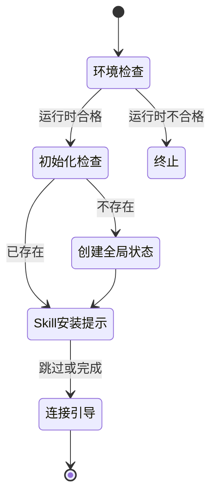
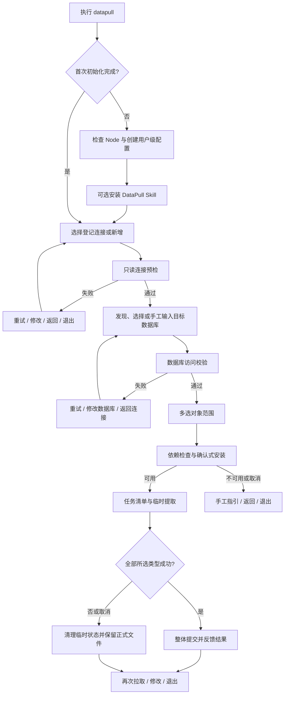

# DataPull 软件需求规格说明书

## 文档信息

| 项目 | 内容 |
|---|---|
| 项目名称 | DataPull |
| 文档类型 | 软件需求规格说明书（SRS） |
| 文档版本 | v1.0 |
| 文档状态 | 评审稿 |
| 编写日期 | 2026-09-18 |
| 目标交付物 | 公开 NPM CLI、内置轻量 DataPull Skill、YG Toolkit Skill 同步副本 |
| 明确保护项 | 现有 `plugins/yg-toolkit/skills/database-schema/` 不修改 |

## 1. 引言

### 1.1 编写目的与预期读者

本文档定义 DataPull 首版的可实现、可验证需求。DataPull 是一个通过 NPM 发布的命令行产品：它优先为人在终端内完成登记连接、校验、选择目标数据库和获取数据库对象结构文件提供中文交互；同时向高级用户和 Agent 提供稳定的命令模式接口。

预期读者为使用 DataPull 的用户，负责实现、测试和发布 `@yg-toolkit/datapull` 的人员，使用 DataPull Skill 的 Agent 维护者，以及审查数据库访问、凭证处理和项目文件变更边界的安全与运维人员。除非另有说明，本文“必须”表示首版验收条件，“应”表示实现约束或推荐行为，“可以”表示用户选项。

### 1.2 项目背景与问题陈述

团队需要将多个数据库中的对象定义保存为便于浏览、检索和版本控制的 SQL 文件。现有 `database-schema` Skill 仅作为业务行为和测试场景参考，不能满足 NPM 分发、跨平台依赖引导、全局连接登记簿、完整交互流程及稳定命令接口的产品目标。

DataPull 解决以下问题：数据库官方工具或权限缺失时缺少诊断与恢复路径；连接、目标数据库与凭证不能安全复用；在子目录运行或只更新部分对象类型时输出和覆盖影响不清晰；以及 Agent 不应在不透明情况下修改全局环境或接触数据库凭证。

### 1.3 产品目标与成功标准

DataPull 的目标是让用户无需记忆复杂参数即可完成可恢复的结构文件拉取；让同一用户跨项目复用登记连接而不把凭证写入项目；让 `.database-schema/` 中的结构文件可直接浏览与纳入版本控制；让依赖安装和覆盖影响在操作前可见、可确认；并在不改变旧 `database-schema` Skill 的前提下独立演进。

首版最低成功判定为：在本期支持的平台和数据库组合上，用户能够从公开 NPM 包安装 CLI，完成隐藏凭证输入、连接和目标数据库校验、对象范围选择，并在正确的项目根目录获得结构文件；失败时已有结构文件及已填写输入受到保护，且用户获得中文恢复选项。

### 1.4 定义与缩写

| 术语 | 定义 |
|---|---|
| DataPull | 面向人类交互、同时可被 Agent 调用的数据库结构文件拉取 CLI。 |
| DataPull Skill | 检测环境、协助用户安装 DataPull、指导 Agent 安全调用 CLI 的轻量 Skill。 |
| 引导模式 | 只执行 `datapull` 时进入的中文分步交互流程。 |
| 命令模式 | 通过子命令和参数直接执行操作的非交互流程。 |
| 登记连接 | 保存服务器信息、认证引用与连接安全策略的连接配置。 |
| 全局连接登记簿 | 当前用户可跨项目复用的登记连接集合。 |
| 数据库凭证 | 独立保存、用于数据库身份认证且不得进入日志或结构文件的秘密值。 |
| 目标数据库 | 一次拉取明确选择或输入的真实数据库。 |
| 数据库对象 | 可用 DDL 表达的表、视图、函数、过程、触发器等命名实体。 |
| 结构文件集 | DataPull 按对象类型维护的 DDL 文件集合；不承诺全部类型来自同一时点。 |
| Skill 安装目标 | 用户选择的 Agent 工具与用户级或项目级安装范围组合。 |

### 1.5 参考资料与决策记录

| 编号 | 资料 | 用途 |
|---|---|---|
| REF-001 | `.yg-pm/projects/datapull/source-requirements.md` | 原始需求、已确认决策与数据库能力基线。 |
| REF-002 | `.yg-pm/projects/datapull/drafts/outline-20260918-165112.md` | 章节、术语、需求 ID 和范围边界。 |
| ADR-0003 | `docs/adr/0003-reuse-schema-directory-without-legacy-compatibility.md` | 复用输出目录但不承诺旧 Skill 兼容。 |
| ADR-0004 | `docs/adr/0004-confirm-before-installing-database-tools.md` | 自动安装数据库工具前展示计划并确认。 |
| ADR-0005 | `docs/adr/0005-build-datapull-independently-without-python-runtime.md` | 独立构建且不依赖 Python 运行时。 |
| ADR-0006 | `docs/adr/0006-own-datapull-skill-source-in-cli-package.md` | DataPull Skill 唯一源码及同步原则。 |
| REF-003 | [Node.js 发行计划](https://nodejs.org/en/about/previous-releases) | Node.js 支持与 LTS 策略。 |
| REF-004 | [Commander 文档](https://github.com/tj/commander.js) | 分层命令解析。 |
| REF-005 | [Inquirer Prompts 文档](https://github.com/SBoudrias/Inquirer.js) | 交互提示与隐藏输入。 |
| REF-006 | [Listr2 文档](https://listr2.kilic.dev/) | 可视任务清单与进度。 |
| REF-007 | [execa 文档](https://github.com/sindresorhus/execa) | 安全执行外部数据库工具。 |
| REF-008 | [Codex Skill 路径源码](https://github.com/openai/codex/blob/main/codex-rs/ext/skills/src/host_roots.rs)；[Claude Code Skills 文档](https://code.claude.com/docs/en/skills)；[Cursor Skills 文档](https://cursor.com/docs/skills)；[Trae Skills 文档](https://docs.trae.cn/ide_skills) | Agent Skill 路径与发现验证。 |
| REF-009 | [MySQL 客户端选项](https://dev.mysql.com/doc/refman/8.4/en/mysql-command-options.html)；[PostgreSQL psql](https://www.postgresql.org/docs/current/app-psql.html) 与 [pg_dump](https://www.postgresql.org/docs/current/app-pgdump.html)；[SQL Server sqlcmd](https://learn.microsoft.com/sql/tools/sqlcmd/sqlcmd-utility) 与 [SMO 脚本](https://learn.microsoft.com/sql/relational-databases/server-management-objects-smo/tasks/scripting) | 数据库官方工具与脚本能力。 |

## 2. 产品范围与边界

### 2.1 目标用户与核心场景

| 用户类型 | 使用场景 | 可观察结果 |
|---|---|---|
| 数据库维护人员或开发人员 | 首次登记连接并拉取对象定义。 | 连接经校验后可复用，结构文件位于项目根目录。 |
| 项目开发人员 | 在 Git 仓库子目录更新表或视图。 | CLI 定位 Git 顶层目录；未选择类型不受影响。 |
| 高级用户 | 以参数执行连接管理、拉取、诊断或 Skill 安装。 | 可用退出码和可选 JSON 判断结果。 |
| 使用 Agent 的用户 | Skill 已安装但 CLI 缺失或配置不完整。 | Skill 给出用户亲自执行的安装命令并指导后续调用。 |

### 2.2 本期包含范围

1. 公开 NPM 包 `@yg-toolkit/datapull` 和 `datapull` 命令；
2. 中文引导模式（列表单选、多选、输入、隐藏输入、确认、任务清单及动态进度）；
3. MySQL、PostgreSQL、SQL Server 的登记连接管理、连接校验、数据库枚举/手工输入与校验；
4. 用户级全局连接登记簿和独立用户级数据库凭证；
5. 使用官方数据库工具获取对象 DDL，输出至当前项目 `.database-schema/`；
6. 所选对象类型整体成功后覆盖，未选择类型保留；
7. `connection`、`pull`、`skill`、`config`、`doctor` 子命令以及稳定退出码和可选 `--json`；
8. 确认后跨平台安装官方数据库工具，失败时给出手工指引；
9. Codex、Claude Code、Cursor、Trae IDE 的内置 DataPull Skill 安装、同步保护及反向安装协助。

### 2.3 本期不包含范围

- 修改、迁移、调用或兼容现有 `plugins/yg-toolkit/skills/database-schema/`；
- Python 运行时依赖、`datapull update`、Docker 或其他容器化备用路径；
- 业务数据、用户、角色、授权、对象所有者、MySQL `DEFINER`、服务器级配置导出；
- 云 IAM、OAuth、SSH 隧道、跳板机认证、TraeCode CLI、未列出的 Agent 工具和完整多语言 UI；
- 同一时点完整结构快照或历史版本管理；
- Agent 未获用户许可时执行全局 NPM 安装，或由 Agent 收集、传递数据库凭证。

### 2.4 与现有 `database-schema` Skill 的边界

DataPull 复用 `.database-schema/` 作为项目结构文件根目录，仅为了保留用户对位置的认知；其配置模型、文件格式、覆盖规则和运行行为独立定义。DataPull 不读取、迁移或写回旧 Skill 配置，也不保证两者的输出兼容。旧 Skill 必须保持不变。

## 3. 总体产品模型

### 3.1 产品组件与职责

```mermaid
flowchart TB
    U[用户] --> CLI[DataPull CLI]
    A[Agent] --> SK[DataPull Skill]
    SK -->|环境检测、安装命令、调用指导| U
    SK -->|指导调用| CLI
    CLI --> CFG[全局连接登记簿 config.json]
    CLI --> SEC[数据库凭证 credentials.env]
    CLI --> ROOT[项目根目录]
    ROOT --> SET[.database-schema 结构文件集]
    CLI --> DEP[依赖诊断与安装计划]
    DEP --> PM[系统包管理器]
    PM --> TOOL[数据库官方工具]
    CLI --> TOOL --> DB[(MySQL / PostgreSQL / SQL Server)]
    PKG[@yg-toolkit/datapull] --> CLI
    SRC[cli/datapull/skill 唯一源码] --> PKG
```

| 组件 | 必须负责 | 不得负责 |
|---|---|---|
| DataPull CLI | 交互、命令解析、配置、依赖诊断、数据库校验、提取编排、文件写入和 Skill 安装。 | 运行时调用旧 Python 脚本；替用户决定安装外部工具；导出业务数据。 |
| DataPull Skill | 检测 Node.js、NPM、CLI，给出用户执行的安装命令，指导调用 CLI。 | 存储、询问或传递凭证；复制连接管理或提取逻辑。 |
| 官方数据库工具 | 连接、查询、生成 DDL。 | 管理 DataPull 配置、输出目录或 Skill。 |
| 全局连接登记簿 | 保存非秘密连接元数据与数据库偏好。 | 保存秘密或项目结构文件。 |
| 数据库凭证文件 | 保存秘密值。 | 保存 DDL、项目路径、日志或 Agent 状态。 |

### 3.2 引导模式与命令模式

无子命令时进入引导模式；有效子命令或参数时进入命令模式。两者必须复用连接校验、对象范围校验、依赖校验和覆盖规则。

| 模式 | 入口 | 输出 | 失败处理 |
|---|---|---|---|
| 引导模式 | `datapull` | 中文提示、可视进度、结果摘要。 | 保留输入，提供重试、修改、返回连接选择或退出。 |
| 命令模式 | 如 `datapull pull ...` | 文本或显式 `--json` 的稳定 JSON。 | 返回稳定错误代码和非零退出码，不进入交互恢复。 |

非 TTY 不得渲染交互控件、动画或隐藏输入。`--json` 必须绕过交互和动态渲染：stdout 只输出一个 UTF-8 JSON 对象，所有脱敏诊断写入 stderr。

### 3.3 全局状态与项目结构文件

全局连接登记簿和数据库凭证属于当前操作系统用户；结构文件属于当前项目。当前目录位于 Git 工作树时，项目根为 Git 顶层目录；否则为当前工作目录。DataPull 不得把凭证写入项目、输出、错误或日志，也不得修改项目根 `.gitignore`。删除登记连接不得删除已有结构文件。

### 3.4 运行环境与技术约束

| ID | 约束 | 验证方式 |
|---|---|---|
| CON-001 | 源码位于 `cli/datapull/`，使用 TypeScript strict 模式和 ESM 独立实现。 | 构建配置及运行时依赖审查。 |
| CON-002 | 技术设计必须提供分层命令解析、可访问的单选/多选/隐藏输入、任务清单及安全的无 Shell 子进程执行。Commander 15、`@inquirer/prompts`、listr2、execa 是当前候选组合，不构成 SRS 验收前提。 | 技术设计评审、依赖许可审查及对应契约测试。 |
| CON-003 | Node.js 必须不低于 `22.12`。 | `doctor` 和首次运行检查。 |
| CON-004 | 包名为 `@yg-toolkit/datapull`，命令为 `datapull`。 | 干净环境安装验证。 |
| CON-005 | 支持 Windows 10/11、macOS、Ubuntu LTS、Debian Stable、Fedora。 | 第 13 章矩阵通过。 |
| CON-006 | MySQL 使用 `mysql`；PostgreSQL 使用 `psql`、`pg_dump`；SQL Server 使用 `sqlcmd`、PowerShell、官方 `SqlServer` 模块。 | 真实集成测试。 |
| CON-007 | 工具缺失时必须预览计划并确认；未识别包管理器只给手工指引。 | 未确认前无环境改动。 |
| CON-008 | CLI 不提供自更新命令，升级仅由用户使用 NPM 完成。 | 帮助及命令树审查。 |

## 4. 安装、初始化与升级

**关联需求：FR-001**

### 4.1 发布与环境检查

DataPull 必须以公开 NPM 包发布。用户可执行 `npm install --global @yg-toolkit/datapull`，安装后 `datapull --help` 必须可执行。NPM 生命周期不得启动交互、读取数据库配置、访问数据库或安装 Skill。首次运行、`doctor` 和核心入口必须检查 Node.js `>=22.12`；不满足时阻止后续操作，输出中文升级指引、稳定错误代码和非零退出码，且不得写入配置或项目文件。

### 4.2 首次运行初始化

全局连接登记簿不存在时，引导模式将其视为初始化而非错误。CLI 必须按操作系统标准配置根解析并显示待创建路径：Windows 为 `%APPDATA%/datapull/`，macOS 为 `$HOME/Library/Application Support/datapull/`，Linux 为 `${XDG_CONFIG_HOME:-$HOME/.config}/datapull/`。经用户确认后，在该目录创建带 `version` 和空连接集合的 `config.json`，以及可手工编辑的 `credentials.env`。

CLI 必须创建并验证秘密文件权限：macOS/Linux 的配置目录权限不得宽于 `0700`、`credentials.env` 不得宽于 `0600`；Windows 必须使用显式 ACL，读取主体只允许当前用户以及操作系统管理所必需的 `SYSTEM`、`Administrators`（如适用），不得向 `Users`、`Authenticated Users`、`Everyone` 或其他主体授予读取权限，并确认当前用户拥有读写权限。无法设置或验证安全权限时，必须返回退出码 3 和 `CREDENTIALS_FILE_INSECURE`，拒绝保存、读取或使用数据库凭证。首次运行可以引导安装 DataPull Skill，跳过不得阻塞连接或拉取。



### 4.3 升级与卸载边界

DataPull 不得实现 `datapull update` 或自行调用 NPM 修改全局包。NPM 卸载也不得自动删除全局登记簿、数据库凭证、项目结构文件或已安装 Skill；帮助和 `config path` 应明确残留数据位置。升级后可以提示同步内置 Skill，但不得阻塞核心功能或未经确认覆盖用户修改的副本。

### 4.4 验收标准

| ID | Given | When | Then |
|---|---|---|---|
| AC-FR-001-01 | 合格 Node.js/NPM 的干净环境。 | 安装后执行 `datapull --help`。 | 成功显示中文帮助及主要命令族。 |
| AC-FR-001-02 | NPM 正在安装或升级。 | 生命周期脚本运行。 | 不启动交互，不创建状态，不访问数据库或安装 Skill。 |
| AC-FR-001-03 | Node.js 低于 `22.12`。 | 执行核心入口。 | 不写入文件，给出中文指引、稳定错误代码与非零退出码。 |
| AC-FR-001-04 | 不存在全局登记簿。 | 首次执行 `datapull` 并确认。 | 创建版本化配置与秘密文件后可继续连接引导。 |

## 5. 连接与凭证管理

**关联需求：FR-003、FR-004、FR-005、FR-017**

### 5.1 数据模型与秘密边界

`config.json` 必须保存带 `version` 的全局连接登记簿；`credentials.env` 必须独立保存密码或完整含秘密 URL。前者允许保存连接别名、引擎、主机、端口、用户名、认证引用、TLS、最近使用和收藏；后者不得保存 DDL、日志、项目路径或 Agent 状态。首版不把变量值解释为 Token、IAM 或 OAuth 认证材料。项目目录只保存数据库对象 DDL。

| `config.json` 字段 | 要求 |
|---|---|
| `version`、`connections` | 必填。 |
| `connections[].alias`、`engine` | 必填；别名全局唯一，`engine` 只能为 `mysql`、`postgresql`、`sqlserver`。 |
| `host` / `port` 或 `urlRef` | 连接方式的非秘密地址或引用；不得保存含秘密 URL。 |
| `username`、`credentialRef`、`authMode`、`tls` | 认证与安全策略；Windows 的 SQL Server 可使用集成认证。 |
| `recentDatabases`、`favoriteDatabases` | 可选的目标数据库偏好。 |

未知版本、损坏 JSON、重复别名、无效引擎或无效引用不得被静默修复或覆盖。`datapull config validate` 必须定位错误；每次连接管理、校验或拉取前必须从磁盘重新加载配置。

### 5.2 凭证规则

密码只能通过隐藏输入或用户手工编辑 `credentials.env` 写入。CLI 不得把秘密写入 `config.json`、命令参数历史、stdout、stderr、日志、诊断、JSON 结果或项目目录。数据库凭证文件属于本机明文存储，无法抵御已取得当前用户权限的恶意程序；CLI 必须说明该边界，并在每次读取或写入前验证第 4.2 节的权限要求。权限不安全时必须失败关闭，不能通过普通确认继续。缺失、空值或解析失败的凭证是可恢复错误，报错只能显示引用变量名和修复路径。

SQL Server 默认 `encrypt=true`、`trustServerCertificate=false`；不可信证书不得自动关闭加密或跳过验证。Agent 不得要求用户在聊天或命令参数中发送数据库凭证。

### 5.3 连接 CRUD 与校验

引导模式与命令模式必须提供新增、查看、修改、删除、校验。新增收集别名、引擎、认证方式、非秘密连接参数、TLS 与隐藏凭证；别名冲突必须要求修改或明确更新。查看严格脱敏。修改只影响该连接元数据或凭证。删除必须在交互中显示影响并确认，且不得删除项目结构文件；仅在凭证变量未被其他连接引用且用户明确选择时删除未引用凭证。校验只读，不得修改数据库或结构文件。

连接校验失败时，引导模式保留输入并提供重试、修改、返回连接选择、退出。网络不可达、认证失败、TLS 失败、工具缺失、权限不足必须分别呈现。

### 5.4 多目标数据库与偏好

一个登记连接可对应多个目标数据库。CLI 应尝试枚举用户可访问数据库；枚举失败或无权限时，必须允许手工输入名称并单独校验。候选顺序为收藏、最近使用、可枚举、手工输入。成功完成拉取后更新最近使用；收藏或取消收藏只能由用户显式操作。数据库名不得包含路径分隔符、`.`、`..`、Windows 非法字符或保留设备名，也不得越过项目输出目录。

### 5.5 配置编辑和验收标准

操作过程中发现文件在外部变更时，CLI 必须停止该次写回、重新加载并让用户处理冲突。`config path` 只能显示绝对路径；`config validate` 校验 JSON、版本、字段、引用、秘密文件可解析性及权限，绝不显示秘密值。`config.json` 发生确定性版本迁移前，CLI 必须在同一用户配置根的 `backups/` 下创建受同等权限保护的时间戳备份；备份失败则不迁移。首版不自动迁移 `credentials.env` 格式。

| ID | Given | When | Then |
|---|---|---|---|
| AC-FR-003-01 | 不存在同名连接。 | 用户新增 MySQL、PostgreSQL 或 SQL Server 连接。 | `config.json` 仅含认证引用，秘密文件含相应变量。 |
| AC-FR-003-02 | 已存在连接及项目结构文件。 | 用户确认删除连接。 | 仅更新全局登记簿，项目结构文件不变，引用中的共享凭证不删除。 |
| AC-FR-004-01 | 用户输入密码或含秘密 URL。 | CLI 写入并输出结果。 | 输入不回显，秘密不出现在配置、输出、错误、日志或项目目录。 |
| AC-FR-004-02 | 用户手工编辑有效秘密变量。 | 再次连接校验。 | CLI 读取新值，无需重新登记连接。 |
| AC-FR-005-01 | 一个连接可枚举多个数据库。 | 用户选择数据库。 | 收藏、最近、枚举、手工输入按序展示。 |
| AC-FR-005-02 | 用户无权枚举。 | 手工输入有权访问的数据库。 | 单独校验成功后继续。 |
| AC-FR-017-01 | 连接已校验。 | 拉取后收藏另一数据库。 | 最近记录更新，收藏跨会话保留并优先显示。 |

## 6. 交互式引导流程

**关联需求：FR-002、FR-007、FR-010**

仅执行 `datapull` 时，CLI 必须在 TTY 中进入中文七阶段引导。该流程不得要求用户记忆子命令、对象名称或客户端参数；它与命令模式共享同一连接校验、依赖校验、提取与覆盖规则。

### 6.1 七阶段流程与恢复



首次运行先检查 Node.js `>=22.12` 和全局连接登记簿。初始化成功后，应询问是否安装 DataPull Skill；用户多选硬编码 Agent 目标，再逐个选择用户级或项目级范围。CLI 不得探测 Agent 是否安装。跳过 Skill 不得阻塞连接或拉取。

### 6.2 连接和数据库选择

第一业务步骤展示已启用登记连接，至少显示连接别名、引擎、脱敏位置、最近使用状态和收藏数量，另有“新增登记连接”和“退出”。新增或修改时按引擎显示适用字段：MySQL/PostgreSQL 支持用户名密码或完整 URL 的变量引用；SQL Server 支持用户名密码，且仅 Windows 支持集成认证。保存前显示不含秘密的摘要并确认。

选定连接后执行只读预检，校验配置、认证引用、客户端和安全连接。预检不得修改数据库、创建对象、写入业务数据或降低 TLS。错误必须区分认证、权限、格式、工具缺失和 SQL Server 证书不可信；失败时保留输入，并提供重试、修改、返回和退出。

预检通过后，先展示收藏和最近使用数据库，再展示发现结果，并永久提供手工输入。数据库校验为只读存在性及访问性校验；无法枚举不能阻止手工输入。

### 6.3 对象范围、依赖和进度

按引擎展示对象，多选初始为全部支持对象。常用项优先显示，并提供全选、清空、展开高级对象。

| 引擎 | 常用对象 | 高级对象 |
|---|---|---|
| MySQL | 表、视图、函数、过程 | 触发器、事件 |
| PostgreSQL | schema、表、视图、函数、过程 | 扩展、物化视图、序列、触发器、类型 |
| SQL Server | schema、表、视图、函数、过程 | 触发器、序列、同义词、类型 |

确认前必须说明：本次所选对象类型作为整体更新；未选择类型保留；任一所选类型失败则本次所选类型均不更新。该规则只描述结构文件增量维护，不能称为结构快照。

缺少官方工具时，必须显示工具/模块、官方来源、将执行命令、所需权限、下载或环境影响和重新检测入口。用户确认后才调用已识别包管理器：Windows 使用 `winget` 及 SQL Server 官方 PowerShell 安装路径，macOS 使用 Homebrew，Ubuntu/Debian 使用 `apt`，Fedora 使用 `dnf`。安装逻辑必须来自版本化适配目录；每条记录至少包含操作系统、包管理器、数据库工具、包或模块标识、官方来源、预览命令、权限影响、下载影响、执行参数和安装后重检规则。未识别组合、目录校验失败或安装失败只给手工指引，不得猜测命令、自动切换来源或转用容器。

开始提取后必须显示任务清单和动态进度，至少包括准备临时目录、读取元数据、生成各类型 DDL、校验文件、提交对象类型更新和清理。对象数量未知时显示“正在发现对象”，不得伪造百分比。用户可在安全检查点取消；取消必须终止可安全终止的子进程，清理临时目录和锁，并保留正式结构文件。

### 6.4 结果与验收标准

成功结果必须汇总连接别名、目标数据库、引擎、选中类型、生成或更新文件数、绝对输出路径和时间，并说明未选类型被保留。失败结果必须说明本次所选类型未提交、正式目录保持原状、错误代码和下一步动作。成功或失败后提供再次拉取、修改范围、修改连接/凭证、返回连接选择、退出。

| ID | 验收场景 | 可验证结果 |
|---|---|---|
| AC-06-01 | 用户在 TTY 执行无参数 `datapull`。 | 出现中文七阶段引导。 |
| AC-06-02 | 新用户跳过 Skill 安装。 | 仍可新增连接、校验、选择数据库和拉取。 |
| AC-06-03 | 连接密码错误。 | 秘密不回显；提供重试、修改、返回、退出；正式文件不变。 |
| AC-06-04 | 账号不能列出数据库。 | 可手工输入并独立校验。 |
| AC-06-05 | PostgreSQL 用户展开高级对象。 | 显示扩展、物化视图、序列、触发器、类型，默认全选。 |
| AC-06-06 | 缺少 `psql` 和 `pg_dump`。 | 先展示来源、命令、权限、下载影响；未确认不安装。 |
| AC-06-07 | 提取阶段取消。 | 临时目录和锁清理，正式对象文件不覆盖。 |

## 7. 数据库结构文件拉取

**关联需求：FR-006、FR-008**

### 7.1 通用规则

DataPull 必须以 TypeScript/Node.js 独立编排，并以官方 CLI 或官方脚本对象模型获取 DDL；不得依赖 Python 或调用旧 Skill 脚本，也不得把推测或不完整 DDL 当作成功。仅使用读取元数据和对象定义权限，不得申请数据库写权限。成功对象文件为 UTF-8、LF 换行且可审查的 DDL；表必须含列、约束、索引，触发器必须独立输出。某对象无法读取、外部工具失败、DDL 为空或校验失败，均导致本次所选对象类型集合失败。

### 7.2 引擎对象与工具

| 引擎 | 工具 | 支持对象 |
|---|---|---|
| MySQL | `mysql` | 表、视图、函数、过程、触发器、事件。 |
| PostgreSQL | `psql`、`pg_dump` | schema、扩展、表、视图、物化视图、序列、函数、过程、触发器、类型。 |
| SQL Server | `sqlcmd`、PowerShell、官方 `SqlServer` 模块；macOS/Linux 还需 PowerShell 7。 | schema、表、视图、函数、过程、触发器、序列、同义词、类型。 |

MySQL 使用 `INFORMATION_SCHEMA` 和 `SHOW CREATE`；密码只能经仅当前用户可读的临时 option file 传递。该文件在客户端启动前必须按第 4.2 节同等强度设置并验证权限，验证失败不得启动 `mysql`；无论成功、失败或取消都必须删除。PostgreSQL 使用系统目录、`pg_get_*def` 或逐对象 `pg_dump --schema-only`；秘密仅注入子进程 `PGPASSWORD`。SQL Server 以 `sqlcmd` 预检、官方 SMO `Scripter` 生成 DDL；秘密仅注入 `SQLCMDPASSWORD`，不得使用 `-P`。三种引擎均不得将秘密放入命令行参数。

SQL Server 必须固定使用 `encrypt=true`、`trustServerCertificate=false`。`sqlcmd` 预检与 SMO 提取必须映射为相同的严格 TLS 策略；证书不可信时返回 `SQLSERVER_TLS_CERTIFICATE_UNTRUSTED`，停止执行并给出安装可信 CA 链或修复服务器证书的指引。首版不提供命令参数、交互选项或连接配置来绕过证书验证，也不得关闭加密。

### 7.3 兼容、安全及排除

目标兼容范围为厂商仍处于官方支持期的版本；只有兼容矩阵中实际验证通过的服务端、客户端和平台组合才能声明“支持”。可能兼容但未验证组合须标为“计划兼容”并提示；已知不兼容组合必须阻止拉取并指引升级。

不得输出业务数据、二进制数据、账户、登录名、角色、授权、权限、密码、令牌、服务器配置、作业、云身份、隧道、对象所有者及 MySQL `DEFINER`。若官方工具默认输出上述内容，必须在临时阶段移除或规范化；无法可靠排除则失败且保留正式目录。所有外部工具调用必须采用参数数组或等价安全机制，不得拼接未验证输入为 Shell 命令。

### 7.4 验收标准

| ID | 场景 | 可验证结果 |
|---|---|---|
| AC-07-01 | 三引擎选择表。 | 每表独立 UTF-8 SQL，含列、约束、索引。 |
| AC-07-02 | MySQL 选择函数、过程、触发器、事件。 | 四类分别输出，命令和文件不含密码、`DEFINER`。 |
| AC-07-03 | PostgreSQL 存在同名重载函数。 | 输出唯一、稳定且可读的文件。 |
| AC-07-04 | SQL Server 使用不可信证书。 | 返回 TLS 错误且未自动关闭加密。 |
| AC-07-05 | 某对象无读取权限。 | 本次所选类型不提交，旧文件保留。 |
| AC-07-06 | 扫描产物和日志。 | 无业务数据、账户、角色、授权、所有者或秘密。 |
| AC-07-07 | 无法把 MySQL 临时 option file 限制为仅当前用户可读。 | 不启动 `mysql`，返回凭证安全错误，并删除临时文件。 |

## 8. 项目目录与覆盖规则

**关联需求：FR-009、NFR-003**

### 8.1 根目录与标准层级

每次 `pull` 从执行目录定位项目根：在 Git 工作树中用 `git rev-parse --show-toplevel`，非 Git 时用当前工作目录。没有自定义输出目录参数；不得写入安装目录或用户配置目录。结果页及 JSON 必须回显项目根与最终 `outputPath`。

```text
<project-root>/
└── .database-schema/
    ├── .gitignore
    ├── .tmp/                         # 临时提取，可忽略
    ├── .locks/                       # 本地并发锁，可忽略
    ├── .transactions/                # 覆盖事务日志，可忽略
    ├── .backups/                     # 提交期回滚备份，可忽略
    └── <连接别名>/
        └── <目标数据库>/
            ├── table/
            │   └── <schema>/         # MySQL 可省略
            │       └── <对象>.sql
            ├── view/
            ├── function/
            └── <其他对象类型>/
```

路径优先使用连接别名、目标数据库、对象类型、schema 和对象的可读名称。PostgreSQL/SQL Server 用 schema 隔离同名对象；MySQL 可省略。重载、冲突、保留设备名或跨平台非法名称在规范化名称后追加由引擎、schema、类型和对象标识决定的稳定短哈希。所有目录段拒绝路径分隔符、`.`、`..`、NUL、Windows 非法字符与保留设备名；内容统一 UTF-8/LF，任何路径不得越出 `.database-schema/`。

### 8.2 整体覆盖与保留

提交单位为“连接别名 + 目标数据库 + 本次所选对象类型集合”。每次运行必须使用唯一运行 ID 隔离 `.tmp/<run-id>/`、`.backups/<run-id>/` 和 `.transactions/<run-id>.json`，不同数据库并发不得共享临时路径。CLI 先生成并校验集合内全部 DDL，再写入持久化事务日志，记录提交阶段、所选类型、原目录、暂存目录和备份目录；仅全部所选类型成功才开始替换正式目录。

正常错误或取消必须在当前进程中回滚。进程崩溃、强制终止或断电可能留下“待恢复”事务；任何后续 DataPull 命令在读取或写入该目标前，都必须先根据事务日志完成幂等恢复，使全部所选类型回到操作前状态，随后清理事务日志和备份。锁记录必须包含运行 ID、进程 ID、创建时间和目标标识；启动时先验证持锁进程是否仍存活，仅在确认无活进程持有时回收陈旧锁并执行事务恢复，无法判定锁是否陈旧时失败关闭。无法安全判定或恢复时必须返回 `OUTPUT_COMMIT_ROLLBACK_FAILED` 并阻止继续操作，不能把半更新结果报告为成功。空对象类型是有效结果，整体成功后应清理该已选类型中已不存在的旧对象文件。

未选类型必须原样保留；已选类型成功后必须与本次发现结果一致并清理该类型陈旧文件。结果和 JSON 仅用 `updatedTypes` 与 `preservedTypes` 表达本次覆盖范围；本期仅处理结构文件和覆盖结果。

同一项目根、连接别名、数据库组合必须用本地独占锁保护。失败或取消时清理临时目录、临时秘密通道和锁，并保留所有正式对象文件；异常终止则按上一段在下次访问前恢复。CLI 不修改项目根 `.gitignore`；仅可在 `.database-schema/.gitignore` 忽略 `.tmp/`、`.locks/`、`.transactions/`、`.backups/` 及其他本地运行状态。SQL 文件默认允许纳入 Git。

### 8.3 验收标准

| ID | 场景 | 可验证结果 |
|---|---|---|
| AC-08-01 | Git 子目录执行 `pull`。 | 写入 Git 顶层 `.database-schema/`。 |
| AC-08-02 | 非 Git 目录执行。 | 写入当前目录 `.database-schema/`。 |
| AC-08-03 | 第二次仅选表且数据库删除一张表。 | 表目录刷新并删除已删表；视图、函数保留。 |
| AC-08-04 | 同选表、视图、函数且函数失败。 | 三个已选类型均保持原状态。 |
| AC-08-05 | 两进程拉取同一连接与数据库。 | 后启动进程返回 `OUTPUT_LOCKED`，无冲突写入。 |
| AC-08-06 | 替换阶段模拟失败。 | 恢复旧目录；恢复失败时返回回滚错误。 |
| AC-08-07 | 在已替换首个所选类型后强制终止进程。 | 下次访问该目标前依据事务日志恢复全部所选类型到操作前状态；无法恢复时阻止继续。 |
| AC-08-08 | 崩溃后遗留锁且原进程已不存在。 | 验证进程状态后回收陈旧锁，再执行待恢复事务；无法判定时不写正式文件。 |

## 9. 命令行接口

**关联需求：FR-011、FR-012**

### 9.1 命令树和通用规则

```text
datapull
├── connection add | list | show | update | remove | test
├── database list | favorite add | favorite remove
├── pull
├── skill install | list | status | sync
├── config path | validate
└── doctor
```

命令和选项使用英文、kebab-case；面向人类的提示使用简体中文。非交互写入配置、项目目录或 Skill 目录必须有 `--yes`。`--json` 禁用所有交互和动态渲染，stdout 只能在命令结束时输出一个 JSON 文档；执行中的脱敏进度或诊断只能写入 stderr。`--no-color` 禁用 ANSI 色彩。

无参数 `datapull` 在非 TTY 必须以退出码 2、`INTERACTIVE_TTY_REQUIRED` 结束。`connection add` 和其他连接命令统一使用 `--alias <alias>`；密码不得作为 `--password` 或含秘密 `--url` 参数传递。

连接和数据库命令的最小契约如下：

| 命令 | 非交互必需参数 | 行为与结果 |
|---|---|---|
| `connection add` | `--alias`、`--engine`、`--auth-mode`，以及下述认证组合；写入需 `--yes` | TTY 可通过隐藏输入创建凭证；非 TTY 只能引用已经由用户写入安全秘密来源的变量。成功 JSON 含 `connectionAlias`、`engine`、`authMode`。 |
| `connection list` | 无 | 只读返回脱敏连接列表；JSON 含 `connections` 数组。 |
| `connection show` | `--alias` | 只读返回单条非秘密配置、最近使用和收藏信息。 |
| `connection update` | `--alias` 和至少一个待修改的非秘密选项；写入需 `--yes` | TTY 可重新隐藏输入凭证；非 TTY 不接受秘密值，仅允许切换 `--credential-ref` 或 `--url-ref`。 |
| `connection remove` | `--alias --yes` | 删除登记连接但不删除项目结构文件；JSON 含 `connectionAlias`、`removed`。 |
| `connection test` | `--alias`，可选 `--database` | 只读校验服务器或指定目标数据库；JSON 含 `connectionAlias`、`database`、`reachable`。 |
| `database list` | `--connection` | 返回收藏、最近使用及可枚举数据库，并标明来源；枚举失败仍返回可手工输入提示。 |
| `database favorite add/remove` | `--connection --database --yes` | 显式维护收藏；JSON 含 `connectionAlias`、`database`、`favorite`。 |

`connection add/update` 的认证组合必须满足且仅满足下列一项：

- 用户名密码：`--auth-mode password --host <host> [--port <port>] --username <name> --credential-ref <variable>`；
- 完整 URL 引用：`--auth-mode url --url-ref <variable>`；
- Windows SQL Server 集成认证：`--engine sqlserver --auth-mode integrated --host <host> [--port <port>]`。

MySQL/PostgreSQL 可以用 `--ssl-mode <mode>` 保存非秘密 TLS 策略；SQL Server 的严格加密和证书验证不可通过命令参数关闭。`--credential-ref` 与 `--url-ref` 只能是变量名：解析优先级为当前进程环境，其次为安全权限已验证的 `credentials.env`。引用缺失或为空时返回退出码 3，不得回显值。

拉取命令统一为：

```text
datapull pull --connection <alias> --database <database>
              [--include <type[,type...]>]
              [--install-missing] [--yes] [--json]
```

`--connection` 精确匹配登记连接；`--database` 为安全单级名称；省略 `--include` 表示该引擎所有支持对象；`--install-missing` 只有同时带 `--yes` 才能实际修改环境。缺少工具且请求了 `--install-missing`、但未给 `--yes` 时，命令不得安装或拉取，必须以退出码 2、`CONFIRMATION_REQUIRED` 结束；JSON 结果必须包含 `actionPlan.installation`，逐项列出工具、来源、命令、权限与下载影响。给出 `--yes` 后，最终 JSON 必须包含 `installation` 数组，记录每项 `planned`、`installed`、`failed` 或 `manualRequired` 结果以及重检结论；不得在执行前向 stdout 另行输出一份计划 JSON。

### 9.2 Skill、配置与诊断命令

`skill list` 显示硬编码目标和范围，不检测 Agent 安装。`skill install` 接受一个或多个 `--target <agent>:<scope>`，其中每个目标都必须分别指定 `user` 或 `project`，写入前显示路径；非 TTY 还需 `--yes`。`skill status` 可接受零个或多个 `--target`：未指定时只扫描八个硬编码目标/范围路径中的 DataPull Skill 元数据并逐项报告存在、缺失、版本和修改状态，这不构成 Agent 安装检测。`skill sync` 必须接受至少一个 `--target`，不得默认批量覆盖；已修改副本默认停止，只有对明确目标使用 `--force --yes` 且备份成功才覆盖。三条命令的 JSON 均返回 `targets` 数组，每项至少含 `agent`、`scope`、`path`、`status`、`version`、`modified`、`action` 和脱敏错误。`config path` 显示路径不显示秘密；`config validate` 校验配置；`doctor` 检查运行时、平台、包管理器、官方工具、全局配置和当前项目可写性，默认不安装。

### 9.3 JSON、退出码和错误代码

成功 JSON 最小契约：

```json
{
  "ok": true,
  "command": "pull",
  "connectionAlias": "yuga",
  "engine": "postgresql",
  "database": "res-v4",
  "projectRoot": "E:/workspace/demo",
  "outputPath": "E:/workspace/demo/.database-schema/yuga/res-v4",
  "updatedTypes": ["table", "view"],
  "preservedTypes": ["function", "procedure"],
  "objectCounts": { "table": 12, "view": 3 }
}
```

失败 JSON 至少含 `ok:false`、`command`、`error.code`、脱敏 `error.message`/`details`；对 pull 还必须含 `connectionAlias` 与 `database`。取消是稳定失败结果：退出码为 1、错误代码为 `OPERATION_CANCELLED`、`ok:false`，并明确 `outputFilesChanged:false`；若取消发生在安装完成之后，仍须在 `installation` 中如实记录已经发生的环境变更。中文文案可以改善，不得改变字段和代码语义。

| 退出码 | 含义 | 典型稳定错误代码 |
|---:|---|---|
| 0 | 成功 | 无 |
| 1 | 操作已执行、取消或失败 | `OPERATION_CANCELLED`、`DATABASE_AUTH_FAILED`、`DATABASE_ACCESS_DENIED`、`DATABASE_OBJECT_READ_FAILED`、`DATABASE_CLIENT_FAILED`、`SQLSERVER_TLS_CERTIFICATE_UNTRUSTED`、`OUTPUT_COMMIT_FAILED`、`OUTPUT_COMMIT_ROLLBACK_FAILED` |
| 2 | 用法、参数或交互环境错误 | `INTERACTIVE_TTY_REQUIRED`、`INVALID_ARGUMENT`、`INVALID_OBJECT_TYPE`、`INVALID_DATABASE_NAME`、`CONFIRMATION_REQUIRED` |
| 3 | 配置或秘密安全错误 | `CONFIG_INVALID`、`CONFIG_VERSION_UNSUPPORTED`、`CREDENTIALS_UNAVAILABLE`、`CREDENTIALS_FILE_INSECURE` |
| 4 | 运行环境或外部依赖不可用 | `NODE_VERSION_UNSUPPORTED`、`PLATFORM_UNSUPPORTED`、`DATABASE_TOOL_MISSING`、`PACKAGE_MANAGER_UNAVAILABLE` |
| 5 | 本地输出状态冲突 | `OUTPUT_LOCKED`、`OUTPUT_PATH_UNSAFE` |

### 9.4 验收标准

| ID | 场景 | 可验证结果 |
|---|---|---|
| AC-09-01 | 非 TTY 执行无参数命令。 | 退出码 2、`INTERACTIVE_TTY_REQUIRED`，不读取 stdin。 |
| AC-09-02 | `pull ... --json`。 | stdout 仅一个 JSON，进度与诊断不混入。 |
| AC-09-03 | 非 TTY 缺少 `--yes` 的写入操作。 | 不修改状态，退出码 2、`CONFIRMATION_REQUIRED`。 |
| AC-09-04 | `--include table,unsupported`。 | 不启动客户端、不写临时目录，返回 `INVALID_OBJECT_TYPE`。 |
| AC-09-05 | `--install-missing --json` 且缺少 `--yes`。 | 不安装、不拉取；唯一结果 JSON 以 `CONFIRMATION_REQUIRED` 返回完整 `actionPlan.installation`。 |
| AC-09-06 | `--install-missing --yes --json`。 | stdout 仅在结束时输出一个 JSON；其中包含安装结果与重检结论，执行进度只写 stderr。 |
| AC-09-07 | 用户在拉取中取消。 | 返回退出码 1、`OPERATION_CANCELLED`、`outputFilesChanged:false`，所选类型正式文件不变；已完成的工具安装另行如实报告。 |

## 10. DataPull Skill

**关联需求：FR-013、FR-014、FR-015**

### 10.1 职责、源码和禁止事项

DataPull Skill 是轻量技能，不是第二套数据库工具。它必须检查 Node.js `>=22.12`、NPM 与 `datapull`；CLI 缺失或版本不合格时，只提供由用户亲自执行的准确 NPM 安装/升级命令。它可以调用已安装 CLI 的命令模式、读取退出码和 `--json`，但不得实现连接 CRUD、依赖安装或结构提取，也不得索要、存储、打印或向第三方发送数据库凭证、结构文件或全局连接登记簿。

执行 `pull` 前，Skill 必须向用户说明连接别名、目标数据库、对象类型与项目根目录。用户未安装 CLI、未登记连接或未给出目标数据库时，Skill 应停在对应步骤并给出下一条命令，不得臆造默认值。

DataPull Skill 的唯一源码必须位于 `cli/datapull/skill/`；构建时同步到 NPM 包和 `plugins/yg-toolkit/skills/datapull/`。发布前必须比较唯一源码和两份副本的文件清单、内容哈希；不一致阻止发布。现有 `plugins/yg-toolkit/skills/database-schema/` 不得修改。安装副本应含机器可读版本与内容哈希，用于识别用户修改。

### 10.2 硬编码目标与官方安装路径

CLI 固定展示 Codex、Claude Code、Cursor、Trae IDE，不得依据目录、进程、扩展或登录状态判断任何 Agent 已安装。用户选择即表示安装意图。本文中的 Trae IDE 指桌面 IDE 的 Skills 能力；即使官方资料页面或产品品牌出现 TraeCode 字样，也不表示支持 TraeCode CLI。以下为当前官方路径约定；每次发行仍必须以当期官方资料、干净环境发现与实际调用作为验证门。

| Agent | 用户级路径 | 项目级路径 |
|---|---|---|
| Codex | `~/.agents/skills/datapull/SKILL.md` | `<project>/.agents/skills/datapull/SKILL.md` |
| Claude Code | `~/.claude/skills/datapull/SKILL.md` | `<project>/.claude/skills/datapull/SKILL.md` |
| Cursor | `~/.cursor/skills/datapull/SKILL.md` | `<project>/.cursor/skills/datapull/SKILL.md` |
| Trae IDE（macOS/Linux） | `~/.trae-cn/skills/datapull/SKILL.md` | `<project>/.trae/skills/datapull/SKILL.md` |
| Trae IDE（Windows） | `%USERPROFILE%/.trae-cn/skills/datapull/SKILL.md` | `<project>/.trae/skills/datapull/SKILL.md` |

### 10.3 安装、回验与同步

首次运行与 `datapull skill install` 必须按“先选 Agent、再逐项选范围”的中文流程执行。每项预览必须列出目标、范围、绝对路径、将创建目录和将写入文件。项目路径从第 8 章项目根解析；目标目录不存在时，确认后创建，不得视为 Agent 未安装。用户级和项目级可同时安装同一目标，但应提示优先级可能受目标工具影响。

写入后必须校验 `SKILL.md` 存在、frontmatter 可解析、名称为 `datapull`、版本/哈希正确且目标路径未越界。符号链接、不可写目录或越界路径必须停止该目标。一个目标失败不得回滚已成功目标。

同步时比较安装版本、安装时哈希和当前文件哈希：不存在则提示安装；未修改且有内置更新则经确认升级；已修改则停止覆盖，提供差异、备份后覆盖或取消；无法读取元数据则不覆盖。`--force` 必须与目标、范围、`--yes` 一同给出，且必须先在同一安装根创建可恢复备份；备份失败不得覆盖。

### 10.4 验收标准

| ID | 场景 | 可验证结果 |
|---|---|---|
| AC-10-01 | Skill 缺少 CLI。 | 只给用户执行的 NPM 命令，Agent 不执行全局安装。 |
| AC-10-02 | 用户多选目标与不同范围。 | 逐项预览官方绝对路径，确认后创建并回验。 |
| AC-10-03 | 已修改 Skill 副本。 | 默认不覆盖；仅备份成功后的 `--force --yes` 可覆盖。 |
| AC-10-04 | 发布前构建。 | CLI 唯一源码、NPM 与 Plugin 副本哈希一致；旧技能未变化。 |
| AC-10-05 | 发行验证门。 | 四工具分别记录官方路径依据、干净环境发现和实际调用结论。 |
| AC-10-06 | `skill status --json` 未指定目标。 | 只扫描八个硬编码路径并逐项报告 DataPull Skill 状态，不推断 Agent 是否安装。 |
| AC-10-07 | `skill sync` 未指定 `--target`。 | 不覆盖任何副本，返回参数错误；指定目标后只处理这些目标。 |

## 11. 系统接口

本章定义 DataPull 与外部系统之间的稳定边界。任何接口变化若会改变命令、配置、文件、权限、下载来源或安全行为，必须经过兼容性评审并更新相应契约测试。

| 接口 | DataPull 的输入/输出 | 安全与权限边界 | 失败行为 |
|---|---|---|---|
| NPM Registry | 用户通过公开包 `@yg-toolkit/datapull` 安装或升级；包提供 `datapull` 可执行文件。 | CLI 不自行调用 NPM 升级；生命周期无交互、无数据库访问、无 Skill 安装。 | 包不存在、完整性失败或网络失败由 NPM 报告；CLI 不修改本地业务状态。 |
| 用户配置文件系统 | 在第 4.2 节定义的操作系统配置根读写 `config.json`、`credentials.env` 和备份。 | 只允许当前用户访问秘密；权限验证失败即拒绝读取、写入和使用凭证。 | 返回配置或秘密安全错误，项目结构文件不变。 |
| 项目文件系统 | 在 Git 顶层或非 Git 当前目录下读写 `.database-schema/`。 | 拒绝路径穿越、符号链接逃逸和项目根外写入；不修改根 `.gitignore`。 | 事务回滚或下次访问时恢复；无法证明一致性则停止。 |
| 包管理器 | 通过版本化适配目录调用 `winget`、Homebrew、`apt`、`dnf` 或 SQL Server 官方 PowerShell 安装路径。 | 先展示来源、命令、权限和下载影响；仅在用户确认或 `--yes` 后执行。 | 未知组合和失败均转为手工指引，不猜测命令，不切换非官方来源。 |
| MySQL 客户端 | 使用 `mysql` 连接服务端、读取元数据和对象定义。 | 密码只经当前用户可读临时 option file；最小只读数据库权限。 | 客户端、认证、访问或对象读取错误映射为稳定错误代码。 |
| PostgreSQL 客户端 | 使用 `psql`、`pg_dump` 连接服务端并读取定义。 | 凭证仅注入子进程环境；不得进入命令行、stdout 或日志。 | 客户端、认证、访问或对象读取错误映射为稳定错误代码。 |
| SQL Server 工具链 | 使用 `sqlcmd`、PowerShell 7（需要时）和官方 `SqlServer` 模块。 | 凭证仅用 `SQLCMDPASSWORD`；固定加密并验证证书；不得提供绕过选项。 | TLS、模块、认证、访问或脚本错误映射为稳定错误代码。 |
| 数据库网络 | 仅连接用户登记的主机、端口和目标数据库。 | 不建立 SSH 隧道、跳板或云身份会话；不得上传结构或诊断。 | 超时或不可达不得触发重试风暴，也不得修改正式文件。 |
| Agent Skill 文件系统 | 按第 10.2 节硬编码目标写入用户级或项目级 Skill。 | 用户主动选择目标和范围；写前预览；用户修改默认受保护。 | 单目标失败不回滚其他已成功目标，结果逐项报告。 |

## 12. 非功能需求

### 12.1 体验、跨平台与安全

引导、帮助、确认、进度和人类错误解释必须使用简体中文；命令、选项、JSON、错误代码、退出码为稳定英文。非 TTY 不显示菜单、动画或隐藏输入，要求完整参数并建议 `--json`。UI 不得只依赖颜色表达状态，应支持 `NO_COLOR`、`--no-color`、纯文本和窄终端换行，全部选择可仅用键盘完成。

首版支持 Windows 10/11、macOS、Ubuntu LTS、Debian Stable、Fedora 当前稳定版；支持意味着 NPM 安装、配置读写、工具检测、确认式包管理器调用、结构提取和 Skill 安装均有真实验证。其他 Linux 只检测并给指引。

秘密仅由隐藏输入或运行进程提供，必须全链路脱敏；外部工具必须以安全参数数组执行；使用最小只读权限；不得导出禁止内容；不采集遥测或上传诊断。联网只限用户执行 NPM、确认后的包管理器和用户明确配置的数据库连接。

### 12.2 性能、可维护性与迁移

大库处理必须采用流式写入或临时目录，不得无界累积完整 DDL；长任务需显示阶段和已用时间，不得伪造百分比。正常取消或磁盘空间不足必须在当前进程中清理临时状态并保留正式文件；进程异常终止必须在下一次访问前执行第 8.2 节的持久化事务恢复。

业务规则、终端 UI、外部工具适配、文件事务、配置读写、Skill 安装必须可独立测试。`config.json` 带版本字段；可安全迁移版本须备份后确定性迁移，未知或损坏数据失败关闭且不静默丢弃。依赖许可证必须适合公开发布，官方工具安装适配表必须可测试且集中维护。

## 13. 质量保证与验收

### 13.1 测试层级

验收必须区分静态、单元、契约、真实数据库集成、端到端交互、跨 OS、发布包和实际 Agent 发现验证；任一层不能替代其他层。

| 层级 | 最低内容 |
|---|---|
| 单元/契约 | 配置、脱敏、文件名/路径、覆盖事务、锁、错误映射、Skill 修改检测、命令/JSON/退出码契约。 |
| 集成 | 三数据库的连接、枚举与手工数据库、对象提取、只读限制、TLS 失败和工具缺失。 |
| 端到端 | 七阶段引导、失败恢复、确认式安装、取消、整体覆盖和结果反馈。 |
| 发布 | `npm pack`、二进制、Node 下限、许可证、无凭证、无 Python、Skill 副本一致。 |

### 13.2 真实数据库和平台矩阵

每引擎至少使用一个官方支持期内的隔离实例和最小只读账户；测试实例包括共同及特有对象，并可含测试数据以证明其不会导出。发布说明必须使用版本化兼容矩阵，逐项记录 `engine`、`serverVersion`、`clientTools` 及其版本、`os` 及版本、`nodeVersion`、`installAdapterVersion`、`verifiedAt`、`result` 和已知限制。政策支持但未验证组合只能标为计划兼容，不能计入“支持”声明。

| 平台 | NPM/Node | MySQL | PostgreSQL | SQL Server | Skill |
|---|---|---|---|---|---|
| Windows 10/11 | 必测 | 必测 | 必测 | 必测 | 四目标用户级/项目级及发现验证。 |
| macOS | 必测 | 必测 | 必测 | 必测 | 路径创建、回验及目标发现验证。 |
| Ubuntu LTS | 必测 | 必测 | 必测 | 必测 | 同上。 |
| Debian Stable | 必测 | 必测 | 必测 | 必测 | 同上。 |
| Fedora 当前稳定版 | 必测 | 必测 | 必测 | 必测 | 同上。 |

安全验收至少覆盖秘密扫描、路径穿越、Shell 注入、符号链接逃逸、秘密文件权限降级、SQL Server 证书拒绝，以及输出中无业务数据、角色、授权、所有者或 `DEFINER`。

公开发布前，每种数据库引擎必须至少有一个完整通过的服务端/客户端组合；Windows、macOS、Ubuntu LTS、Debian Stable、Fedora 当前稳定版必须分别有一条通过记录。若单次组合无法同时覆盖这两个维度，可以由多条记录共同满足，但不得用静态检查替代真实安装、连接与拉取验证。

## 14. 实施约束、风险与后续范围

首版交付公开 NPM 包、`cli/datapull/` 独立 TypeScript/Node.js 源码、内置 Skill、同步 Plugin 副本、官方工具适配表、测试和发布说明。旧 `database-schema` Skill 是保护项。

| 风险 | 缓解 |
|---|---|
| 客户端、包名、包管理器变化 | 适配表集中维护；安装前预览；未知平台仅指引；保存实际验证记录。 |
| Agent 路径或发现机制演进 | 硬编码路径与发行验证门；缺证据不宣称可用。 |
| 凭证泄露 | 独立秘密文件、隐藏输入、权限与全链路脱敏、安全回归。 |
| 部分覆盖损坏文件 | 临时目录、所选类型整体提交、回滚、锁与中断清理。 |
| 大库/工具异常 | 流式处理、进度、取消、真实三引擎集成测试。 |
| 自动安装改变环境 | 始终展示来源、命令、权限、影响；交互确认或命令显式授权。 |

发布前必须通过第 13 章矩阵、三数据库真实集成、安全与 TLS 测试、Skill 一致性和 Agent 实际发现验证；必须确认 `@yg-toolkit` NPM scope 的发布权限、包名可用性和公开访问策略，发布账号应配置最小权限和双因素认证。

后续候选包括容器备用路径、更多 Agent、云 IAM/OAuth/SSH、完整国际化、历史结构版本/完整结构快照、更多数据库和集中式凭证库；均需独立评估。

## 15. 附录

### 15.1 术语表

| 术语 | 定义 |
|---|---|
| DataPull | 面向人类交互、同时可被 Agent 调用的数据库结构文件拉取 CLI。 |
| DataPull Skill | 检测环境、协助用户安装 DataPull、指导 Agent 安全调用 CLI 的轻量 Skill。 |
| 引导模式 | 只执行 `datapull` 时进入的中文分步交互流程。 |
| 命令模式 | 通过子命令和参数直接执行操作的非交互流程。 |
| 登记连接 | 保存服务器信息、认证引用与连接安全策略的连接配置。 |
| 全局连接登记簿 | 当前用户可跨项目复用的登记连接集合。 |
| 数据库凭证 | 独立保存、用于数据库身份认证且不得进入日志或结构文件的秘密值。 |
| 目标数据库 | 一次拉取明确选择或输入的真实数据库。 |
| 数据库对象 | 可用 DDL 表达的表、视图、函数、过程、触发器等命名实体。 |
| 结构文件集 | DataPull 按对象类型维护的 DDL 文件集合；不承诺全部类型来自同一时点。 |
| Skill 安装目标 | 用户选择的 Agent 工具与用户级或项目级安装范围组合。 |

本表与第 1.4 节必须保持一致，是实现、帮助、DataPull Skill 和测试用例的标准词汇；不得用“数据库备份”“结构快照”“Agent 模式”等词替代“结构文件集”“结构文件拉取”“命令模式”。

### 15.2 需求清单

| ID | 名称 | 优先级 | 唯一主章节 | 补充章节 |
|---|---|---:|---:|---|
| FR-001 | NPM 安装与首次运行 | P0 | 4 | 11、13 |
| FR-002 | 中文交互引导 | P0 | 6 | 12、13 |
| FR-003 | 连接 CRUD | P0 | 5 | 9、13 |
| FR-004 | 凭证管理 | P0 | 5 | 9、11、12、13 |
| FR-005 | 多数据库选择 | P0 | 5 | 6、13 |
| FR-006 | 动态对象范围 | P0 | 7 | 6、13 |
| FR-007 | 工具检测与安装 | P0 | 6 | 9、11、13 |
| FR-008 | 结构文件拉取 | P0 | 7 | 8、11、13 |
| FR-009 | 事务覆盖 | P0 | 8 | 13 |
| FR-010 | 进度与结果 | P0 | 6 | 9、13 |
| FR-011 | 分层子命令 | P0 | 9 | 13 |
| FR-012 | Agent 自动化接口 | P0 | 9 | 10、13 |
| FR-013 | Skill 安装 | P0 | 10 | 11、13 |
| FR-014 | Skill 同步保护 | P0 | 10 | 13 |
| FR-015 | Skill 反向协助 | P0 | 10 | 13 |
| FR-016 | 配置诊断 | P1 | 9 | 5、13 |
| FR-017 | 收藏管理 | P1 | 5 | 9、13 |
| NFR-001 | 跨平台兼容 | P0 | 12 | 11、13 |
| NFR-002 | 安全与隐私 | P0 | 12 | 5、7、11、13 |
| NFR-003 | 可移植输出 | P0 | 12 | 8、11、13 |
| NFR-004 | 人类优先体验 | P0 | 12 | 6、13 |
| NFR-005 | 可维护性 | P0 | 12 | 3、11、13 |

### 15.3 章节覆盖映射

唯一主章节以第 15.2 节为准；下表用于展示正文的需求覆盖和交叉引用，不改变需求的唯一主归属。

| 关联章节 | 关联需求 ID | 需求摘要 |
|---|---|---|
| 4. 安装、初始化与升级 | FR-001 | NPM 安装、运行时检查、初始化和升级边界。 |
| 5. 连接与凭证管理 | FR-003、FR-004、FR-005、FR-017 | 连接、秘密、多数据库及收藏管理。 |
| 6. 交互式引导流程 | FR-002、FR-007、FR-010 | 中文向导、依赖安装、进度和失败恢复。 |
| 7. 数据库结构文件拉取 | FR-006、FR-008 | 动态对象范围和三引擎只读拉取。 |
| 8. 项目目录与覆盖规则 | FR-009、NFR-003 | 目录组织、所选类型事务覆盖和可移植文件。 |
| 9. 命令行接口 | FR-011、FR-012、FR-016 | 分层命令、JSON、退出码和诊断接口。 |
| 10. DataPull Skill | FR-013、FR-014、FR-015 | Skill 安装、同步保护和反向协助。 |
| 11. 系统接口 | FR-001、FR-004、FR-007、FR-008、FR-013、NFR-001、NFR-002 | NPM、文件系统、包管理器、数据库和 Agent Skill 的外部边界。 |
| 12. 非功能需求 | NFR-001、NFR-002、NFR-003、NFR-004、NFR-005 | 平台、安全、体验、输出和可维护性。 |
| 13. 质量保证与验收 | 全部需求 | 需求对应的验证层级和发布证据。 |

### 15.4 命令和 JSON 示例

```bash
# 人类交互入口
datapull

# 新增登记连接：凭证仅经隐藏输入写入 credentials.env
datapull connection add --alias yuga --engine postgresql --host db.example.internal --port 5432

# 本机诊断
datapull doctor

# 非交互拉取
datapull pull --connection yuga --database res-v4 --include table,view --yes --json

# 为每个 Agent 分别指定安装范围
datapull skill install --target codex:user --target cursor:project --yes
```

```json
{
  "ok": true,
  "command": "pull",
  "connectionAlias": "yuga",
  "database": "res-v4",
  "outputPath": "E:/work/app/.database-schema/yuga/res-v4",
  "updatedTypes": ["table", "view"],
  "preservedTypes": ["function", "procedure"]
}
```

所有成功、失败和取消结果都必须采用第 9.3 节的退出码 0—5 及稳定错误代码；不得使用其他数字退出码或与该表冲突的错误代码语义。

### 15.5 数据库对象支持矩阵

| 对象 | MySQL | PostgreSQL | SQL Server |
|---|---:|---:|---:|
| schema | — | 支持 | 支持 |
| extension | — | 支持 | — |
| table（列、约束、索引） | 支持 | 支持 | 支持 |
| view | 支持 | 支持 | 支持 |
| materialized view | — | 支持 | — |
| sequence | — | 支持 | 支持 |
| function / procedure / trigger | 支持 | 支持 | 支持 |
| event | 支持 | — | — |
| type | — | 支持 | 支持 |
| synonym | — | — | 支持 |

### 15.6 Agent Skill 安装路径矩阵

| Agent | 用户级 | 项目级 | 验证门 |
|---|---|---|---|
| Codex | `~/.agents/skills/datapull/SKILL.md` | `<project>/.agents/skills/datapull/SKILL.md` | 官方资料、干净环境发现、实际调用。 |
| Claude Code | `~/.claude/skills/datapull/SKILL.md` | `<project>/.claude/skills/datapull/SKILL.md` | 官方资料、干净环境发现、实际调用。 |
| Cursor | `~/.cursor/skills/datapull/SKILL.md` | `<project>/.cursor/skills/datapull/SKILL.md` | 官方资料、干净环境发现、实际调用。 |
| Trae IDE | macOS/Linux `~/.trae-cn/skills/datapull/SKILL.md`；Windows `%USERPROFILE%/.trae-cn/skills/datapull/SKILL.md` | `<project>/.trae/skills/datapull/SKILL.md` | 官方资料、干净环境发现、实际调用；不含 TraeCode CLI。 |
